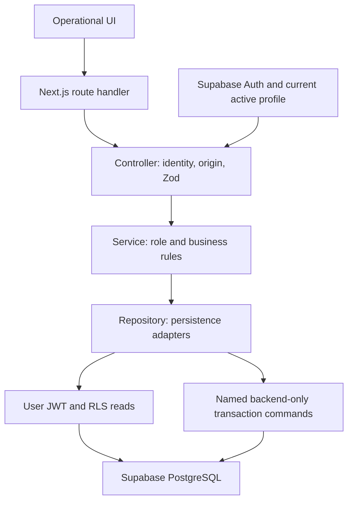

# ApparelFlow

ApparelFlow is a persistent garment cutting and verification terminal. A separate
Cutting Verifier must count every required component before a batch can reach
sewing. System administration manages accounts without manufacturing authority.

**Production application:** [https://apparel-flow.vercel.app/](https://apparel-flow.vercel.app/)

The functional implementation and semantic UI are complete. This branch adds the
requested read-only production audit, favicon and loading polish. Live verification
is recorded in [the final assessment report](docs/17_FINAL_ASSESSMENT_VERIFICATION.md);
the existing deployment is verified separately from this local branch.
[DEPLOYMENT_GUIDE.md](DEPLOYMENT_GUIDE.md) documents how to reproduce the environment.

## Business workflow

1. Cutting Supervisor selects Casual Blouse or Crop Top, enters garment quantity,
   fabric roll and actual yards, then saves preparation. The server derives the
   complete BOM and expected fabric.
2. Submit freezes recipe/target/component requirements and creates an uncounted
   verification attempt atomically.
3. Cutting Verifier enters actual pieces and explicitly selects **Save Counts**.
   Blank means uncounted; zero is a real count. Match is GREEN, excess YELLOW,
   shortage RED. Every required item must be counted without a shortage.
4. Approve writes immutable verifier/time/count/fabric evidence and sets VERIFIED
   in one transaction. Reject needs a trimmed 1–1000 character reason; physical
   defects can justify rejection even with matching counts.
5. A rejected order returns for **Begin Re-cut**. Its frozen recipe/target and
   earlier evidence stay intact; resubmission creates fresh blank counts.
6. Sewing Supervisor sees only VERIFIED batches and their approved evidence.
   **Start Sewing Assembly** records actor/time once and keeps VERIFIED.

Expected pieces = target garments × pieces per garment. For 50 Casual Blouses,
Sleeve Cuffs and Sleeves each require 100 pieces; expected fabric is 90 yards.
Signed wastage = `(actual - expected) / expected × 100`. Negative values remain
negative, and recipe caps are informational rather than approval gates.

## Technology and architecture

Exact dependency pins and lockfile are committed: Next.js 16.3.8 App Router,
React 19.3.0, TypeScript 5.9.3, Tailwind 4.3.3/shadcn foundation, Zod 4.6.5,
Supabase PostgreSQL/Auth/JS 2.117.2/SSR 0.12.7, Vitest 5.0.3, Playwright 1.63.0
and Supabase CLI 2.119.0. Development uses Node 22.23.2 and npm 10.9.8.



Routes serialize responses; controllers validate the boundary; services enforce
rules; repositories contain queries/RPCs. Business logic and database queries do
not live in route handlers or UI components. No generic status-update endpoint,
permission engine, microservices or extra manufacturing modules are included.

| Location                                               | Responsibility                                                       |
| ------------------------------------------------------ | -------------------------------------------------------------------- |
| `src/app`                                              | Pages, protected layouts and thin API handlers                       |
| `src/components`                                       | Accessible operational forms/tables/dialogs                          |
| `src/modules`                                          | Domain DTOs, strict Zod schemas and pure calculations                |
| `src/server/controllers` / `services` / `repositories` | Boundary, rules, storage                                             |
| `src/lib/supabase`                                     | Separate user-context and privileged server factories                |
| `supabase/migrations` / `tests`                        | Forward schema history and actual SQL tests                          |
| `scripts`                                              | Operator bootstrap, migration/type verification, private-value audit |
| `tests`                                                | Unit/API fixtures and real browser journeys                          |

## Database and security

Ten application tables hold profiles, immutable recipes/components, cutting
orders, frozen order components, verification attempts/items/logs/log-items and
admin audit. Six enums use the approved four production states. Historical
foreign keys restrict deletion; triggers prevent manifest/evidence rewrites and
hard deletion. Two invoker views preserve exact decimal evidence and approved-only
sewing projections. Generated types come from Supabase CLI, never hand edits.

Supabase `auth.users` authenticates; the matching current active `profiles` row
supplies role/name. Every protected request uses server-confirmed `getUser()` and
fresh profile authorization. Auth metadata and client JSON cannot grant authority.
Independent roles are CUTTING_SUPERVISOR, CUTTING_VERIFIER, SEWING_SUPERVISOR and
SYSTEM_ADMIN. An order creator cannot verify it even after role reassignment.
Public signup is disabled. The admin UI cannot create another admin or assign
production permissions to the acting admin.

User JWTs perform RLS-scoped reads. Anonymous reads, raw authenticated writes and
privileged browser RPC execution are denied. Four admin and eight production
backend gateways call restricted private commands with pinned search paths.
Commands lock/recheck actor/state/revision and commit evidence with state.
Sewing RLS hides unapproved orders and earlier rejected children of verified
re-cuts. Service secret use is limited to server command/Auth-admin adapters and the guarded, SELECT-only production audit repository.

SSR Proxy refreshes cookies; pages/APIs independently check current roles.
Cookies are HttpOnly, SameSite=Lax and Secure on HTTPS. Mutations require the exact
`APP_ORIGIN`; private responses use `private, no-store` and sanitized errors with
request IDs. Failed admin Auth/profile provisioning attempts safe cleanup of only
the newly created incomplete identity and returns an error.

## Local setup

Prerequisites: Node 22/npm 10, a configured Supabase project, PostgreSQL `psql`
for operator cloud checks, and Docker for isolated SQL tests/type generation.

```bash
git clone https://github.com/SMS123456789/apparel-flow.git
cd apparel-flow
nvm use
npm ci
cp .env.example .env.local
```

Copy the environment template only when creating a new local configuration;
preserve an existing `.env.local`. Edit its placeholders privately. Required
application variables are `NEXT_PUBLIC_SUPABASE_URL`,
`NEXT_PUBLIC_SUPABASE_PUBLISHABLE_KEY`, `SUPABASE_SECRET_KEY` and `APP_ORIGIN`.
Use `APP_ORIGIN=http://localhost:3000` locally, without a trailing slash. Secrets
and environment files must stay out of Git. The deployment guide lists every
application/demo/operator variable and its source.

```bash
npm run dev
```

Open <http://localhost:3000/login>. Authentication is email/password or a real
configured demo persona; there is no OAuth/email callback route.

## Migrations and evaluator provisioning

For the existing assessment cloud project, first verify the committed history:

```bash
npm run supabase:check
npm run supabase:remote:list
npm run supabase:schema:verify
```

For a new compatible Supabase project or unapplied migrations, configure operator
`SUPABASE_DB_PASSWORD` and, if needed, password-free `SUPABASE_DB_URL` in ignored
`.env.local`, inspect the plan, then apply the forward migrations:

```bash
npm run supabase:remote:plan
npm run supabase:remote:push
npm run supabase:schema:verify
npm run supabase:types
```

The plan should list only intended forward versions. Do not reset the cloud DB,
rewrite applied SQL or run mutation-test fixtures against it. On this Linux
workspace, type generation uses `DOCKER_HOST=unix:///var/run/docker.sock` if the
CLI cannot otherwise reach the host Docker daemon. `supabase/config.toml` controls
a local stack and does not configure cloud Auth.

Disable **Allow new users to sign up** in cloud Authentication settings. Configure
private `BOOTSTRAP_ADMIN_EMAIL`, `BOOTSTRAP_ADMIN_PASSWORD` and optionally
`BOOTSTRAP_ADMIN_FULL_NAME`, plus each `DEMO_*_EMAIL` / `DEMO_*_PASSWORD` pair from
[.env.example](.env.example). Use distinct controlled accounts and passwords of
12–128 characters. Then run:

```bash
npm run bootstrap:users
```

This creates/verifies the private initial admin and three active demo profiles.
It is idempotent, confirms controlled Auth users and does not reset passwords or
overwrite existing role/activity mismatches. Keep admin credentials private.

Set `DEMO_ACCOUNTS_ENABLED=true` and all six demo variables to enable `/login`'s
**Demo Accounts** buttons. Each button signs in a separate real Auth account;
passwords stay server-side. Evaluators sign out between personas:

| Persona            | Workspace                           | Task                                            |
| ------------------ | ----------------------------------- | ----------------------------------------------- |
| Cutting Supervisor | `/supervisor`                       | Create, prepare, submit and re-cut              |
| Cutting Verifier   | `/verifier` and `/verifier/history` | Save counts, approve/reject and inspect history |
| Sewing Supervisor  | `/sewing`                           | Inspect approved work and start assembly        |

These three assessment accounts are intentionally public evaluator credentials,
as requested for submission. They authenticate real Supabase accounts. Keep the
SYSTEM_ADMIN, infrastructure keys and database password private.

<!-- evaluator-credentials:start -->

| Persona            | Email                                    | Password                               |
| ------------------ | ---------------------------------------- | -------------------------------------- |
| Cutting Supervisor | demo.cutting-supervisor@apparelflow.test | `aA7!OLoYHUcNZQnZ3YjW5OAq9sDnqfq9aKdE` |
| Cutting Verifier   | demo.cutting-verifier@apparelflow.test   | `aA7!ZZWdxET5NdTkOWGd90bnHiCjOC98SpvC` |
| Sewing Supervisor  | demo.sewing-supervisor@apparelflow.test  | `aA7!kSMvnGGSamC7H3xMDzBzqbsb_hv2Bvac` |

<!-- evaluator-credentials:end -->

The private SYSTEM_ADMIN signs in through the ordinary form and uses `/admin`,
`/admin/audit` and the read-only `/admin/production-audit`; there is no public
admin demo button.

## Tests and production build

Configure the real four accounts above and install Chromium once:

```bash
npx playwright install --with-deps chromium
npm run typecheck
npm run lint
npm run format:check
npm test
npm run test:db
npm run test:e2e
npm run build
node --import tsx scripts/audit-private-values.ts
npm audit --omit=dev
```

Expected results: 227 Vitest tests; 29 browser passes with one deliberately skipped
duplicate viewport review; eight migrations and four real two-connection race
checks in disposable PostgreSQL; successful production build. Typecheck/lint/format
exit zero. Browser tests start `next start` at `127.0.0.1:3100` with the matching
origin and use the configured cloud DB. API tests mock persistence adapters;
SQL/browser tests exercise real storage separately. Browser Auth traces are off.

Browser journeys create attributable E2E-CUTTING/E2E-HAPPY/E2E-VERIFICATION/E2E-RECUT/E2E-AUDIT/E2E-PENDING
records. These remain under the no-hard-delete rule. Admin role/activity tests
restore demo accounts and retain their audit. Do not run this suite concurrently
with other users changing those controlled accounts.

For a local production-mode smoke test:

```bash
npm run build
npm run start
```

Use <http://localhost:3000/login> with the matching local `APP_ORIGIN`.

## Submission and limitations

[Submission checklist](docs/16_SUBMISSION_CHECKLIST.md) maps all five assessment
cases and the local evaluator simulation to evidence.
[AI_OPTIMIZATION_REPORT.md](AI_OPTIMIZATION_REPORT.md) records real failures,
human direction and defensive architecture.
[DEPLOYMENT_GUIDE.md](DEPLOYMENT_GUIDE.md) documents the existing Vercel environment and reproduction steps.
[Architecture decisions](docs/14_ARCHITECTURE_DECISIONS.md) retain chunk validation
and correction history. UI work follows [the design contract](docs/15_UI_DESIGN_SYSTEM.md).

Production dependency audit has zero findings. The full development-tool audit
has nine high findings rooted in the unpatched
[braces advisory](https://github.com/advisories/GHSA-vfj7-8cjw-p6xm); npm's suggested
breaking tool downgrades were not applied. ESLint 9 emits an upstream EOL notice.
The application intentionally supports one factory, read-only recipes and sewing
start metadata only. A database owner remains an infrastructure authority beyond
application immutability. See the final assessment report for local-versus-live results; no replacement deployment was performed.
