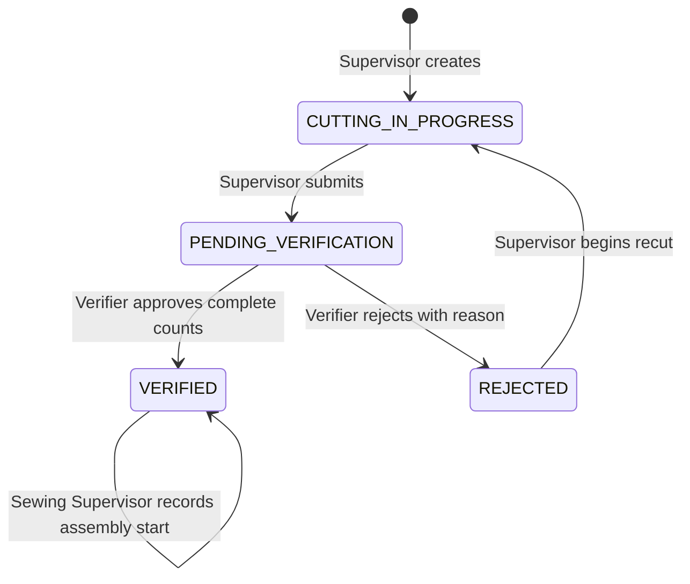

# 04 - Manufacturing state machine

**ASSESSMENT REQUIREMENT (6, p.2; 7.2-7.5, p.3):** Cutting in progress -> pending verification -> verified batch -> Sewing Queue; rejection returns for re-cut with reason. VERIFIED is the required persisted sewing-query status.

## Approved representation

**DESIGN DECISION (approved by user, UD-005/UD-006/UD-007):** Order states are CUTTING_IN_PROGRESS, PENDING_VERIFICATION, REJECTED, VERIFIED. Creation prepares a cutting order; supervisor explicitly submits it. Re-cut reuses that order with a new verification attempt. Start Sewing records sewing_started_at and started_by without changing VERIFIED. Queue is a query, never a client-writable state.

The VERIFIED self-transition records sewing metadata, not another sign-off. No DRAFT, RECUT_IN_PROGRESS, SEWING_QUEUE, or SEWING_IN_PROGRESS enum is needed initially.

## Transition contract

The actor/gate/reason restrictions come from the assessment and approved decisions. Locking, revisions, and response serialization are implementation details of that contract.

| Action | From -> to | Actor | Preconditions and atomic effects |
|---|---|---|---|
| Create | none -> CUTTING_IN_PROGRESS | Supervisor | Four required valid inputs; server order number/actor/time; derive provisional expected quantities. |
| Edit preparation | CUTTING_IN_PROGRESS -> same | Supervisor | Before first submission, editable recipe/target/roll/fabric; derive new expectations. After first submission recipe/target stay frozen, including re-cut. |
| First submit | CUTTING_IN_PROGRESS -> PENDING_VERIFICATION | Supervisor | Snapshot complete required BOM/expected quantities; freeze recipe/target; create OPEN attempt with uncounted items and submitted fabric basis. |
| Save Counts | PENDING_VERIFICATION -> same | Verifier | Actor is not order creator; current OPEN attempt/revision; strict nonnegative integers; persist explicit subset and derive lights. |
| Approve | PENDING_VERIFICATION -> VERIFIED | Verifier | Actor is not creator; reread authoritative DB counts; no RED/missing/uncounted; write immutable evidence and state in one PostgreSQL transaction/RPC. |
| Reject | PENDING_VERIFICATION -> REJECTED | Verifier | Actor is not creator; trimmed reason 1-1000 chars; preserve decision/items and close attempt. Physical defect may justify rejection with GREEN counts. |
| Begin re-cut | REJECTED -> CUTTING_IN_PROGRESS | Supervisor | Same order; retain previous attempts/logs; recipe/target unchanged; prepare replacement cutting/fabric details. |
| Resubmit | CUTTING_IN_PROGRESS -> PENDING_VERIFICATION | Supervisor | Reuse frozen manifest; new attempt and fresh uncounted item set; old attempts remain immutable. |
| Start sewing | VERIFIED -> VERIFIED | Sewing Supervisor | Approval exists; no prior start; set server sewing_started_at/started_by and increment revision atomically. |

Fabric basis for each attempt is stored with that attempt so the final sign-off is not derived from an overwritten earlier attempt. Measuring actual fabric per submitted attempt is an implementation assumption supporting this model; it is not an additional approval gate.

## Illegal actions and errors

**DESIGN DECISION (approved by user):** No generic status PATCH, admin force action, client flag edits, or direct privileged frontend mutations. Wrong role or creator attempting verification -> 403. Invalid state, closed/stale attempt, stale revision, or repeated decision/start -> 409. Pending approval with RED/missing/uncounted -> 422. Invisible/absent resources -> 404.

YELLOW excess is eligible. Wastage-cap warnings and negative fabric variance never add approval gates. Authentication, authorization, legal state, and data integrity are independently enforced.

No VERIFIED -> REJECTED/preparation transition or hard deletion exists in the initial scope. Corrections cannot overwrite immutable audit records.

## Race guarantees and sewing visibility

**DESIGN DECISION (implementation detail under approved UD-012/UD-016):** Related commands share the order lock and revision protocol. Approval/count/reject and resubmit/stale-count races serialize. Each count/decision payload identifies the attempt and revision so it cannot mutate a later attempt. Actor profile locking gives role changes/deactivation a defined serialization point.

Started orders remain VERIFIED and visible with a Started badge in the initial queue implementation. Repeated Start returns 409; there is no separate sewing production status or manual queue insertion.
