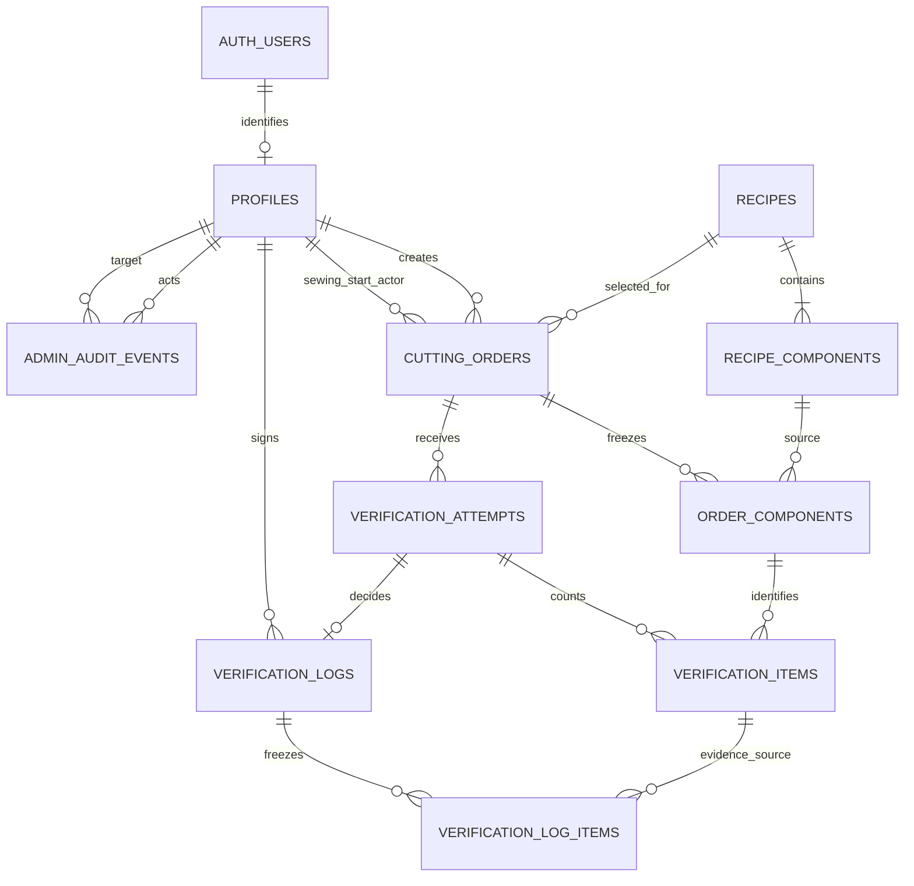
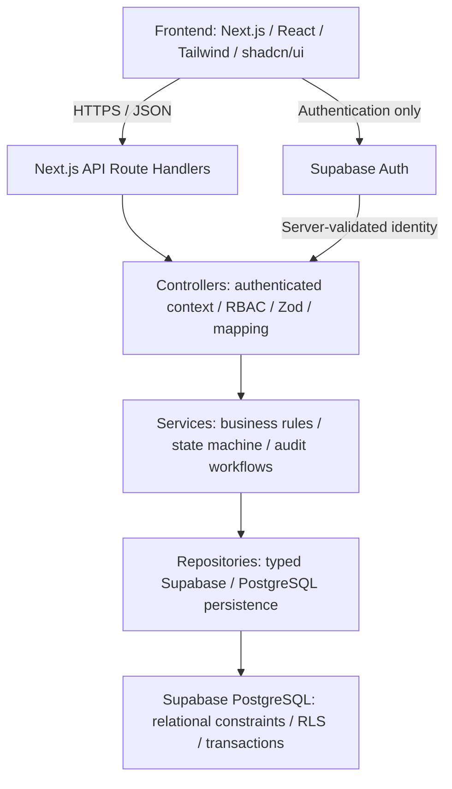

# 05 - Domain model and layer boundaries

Classification follows [00](00_PROJECT_CHARTER.md). G03 implements the database entities/snapshots/history described below; G04–G07 implement identity, order, verification and sewing interfaces/collaborations. The actual tables, constraints, and migration boundaries are in [06](06_DATABASE_DESIGN.md). Controllers/services/repositories preserve those boundaries; the current implementation and validation are summarized in [16](16_SUBMISSION_CHECKLIST.md).

## Bounded modules and entities

| Module | Concepts and responsibilities | Provenance |
|---|---|---|
| Recipes | Recipe(code, name, category, standard yards, cap); RecipeComponent(name, pieces/garment, optional image). Source of expected requirements. | Assessment 7.1/8, pp.3-4 |
| Orders | CuttingOrder(number, recipe, target, fabric roll/actual yards, creator, state, revision); OrderComponentSnapshot supplies complete required manifest. | Order required; snapshot approved UD-008 |
| Verification | VerificationAttempt(number, order, submitted input snapshot, OPEN/APPROVED/REJECTED); VerificationItem(component, expected, nullable actual, derived flag); VerificationDecision/sign-off. | Items/logs required; attempts approved UD-006/UD-016 |
| Sewing | VerifiedBatch read model combines approved order/counts/immutable sign-off; SewingStart metadata (sewing_started_at/started_by) is part of the order, with status still VERIFIED. | Handoff/start required; start fields approved UD-007 |
| Identity/admin | AuthIdentity managed by Supabase Auth; Profile(display name, protected role, active flag, revision); AdministrativeAuditEvent. | Auth/user entity required; admin extension; mapping approved UD-025 |

AdminUserService creates Auth identity with temporary password through the server Auth adapter, then persists Profile plus safe audit. If profile persistence fails, service attempts cleanup of that new incomplete Auth identity and returns error (approved UD-022). No durable provisioning-operation aggregate is required.



Auth identity may briefly exist before its profile, or remain without one after failed cleanup; missing profile always denies application access. A prepared order can have no attempt/manifest yet. Only submitted orders require frozen manifest and attempt/item set. Submission checks completeness, not only foreign keys. Rejection may contain uncounted items; approval may not.

G03 preserves the stronger documented equivalents allowed by its request: order_components is the frozen BOM, attempts use OPEN/APPROVED/REJECTED, and sewing start is an immutable attributed pair on cutting_orders rather than a separate sewing_starts table. Database app_role values are the lowercase assessment identifiers plus system_admin; application/API identifiers are uppercase as documented in [03](03_ROLES_AND_PERMISSIONS.md). This naming mapping does not add roles.

## Aggregate invariants

**ASSESSMENT REQUIREMENT:** Every order uses a recipe; every required component is independently verified; VERIFIED has permanent verifier/time/variance/wastage evidence.

**DESIGN DECISION (implementation detail):**

- CuttingOrder is the consistency boundary for current state, revision, active attempt, and sewing start. Lock this root for every related mutation.
- Recipe facts are copied into the required immutable order manifest when first submitted. Recipes are seeded/read-only; historical expected counts remain fixed (UD-008).
- VerificationAttempt captures recipe/target/fabric basis for its decision. One OPEN attempt per pending order; one finalized decision per attempt (UD-016).
- ActualQty is either uncounted or an integer including zero; a flag is derived, not independent writable authority.
- VerificationLog and log-items are immutable decision evidence. For approved decisions each row stores expected, actual, signed variance, and flag; rejected decisions may preserve nulls (UD-014).
- Re-cut retains finalized attempts and creates a new one, rather than resetting historical log rows (UD-006).
- VerifiedBatch is a projection, never a separate table to which admin or cutting users insert queue membership.
- Users retain historical IDs; display-name changes cannot silently rewrite actor evidence (UD-014/UD-025).

Value concepts: OrderId, RecipeId, ComponentId, ActorContext, OrderRevision, nonnegative Count, positive TargetQty, FabricYards, signed WastagePct, RejectionReason. Bounded types/formatting follow [06](06_DATABASE_DESIGN.md) and [08](08_API_CONTRACT.md); reason is trimmed/nonempty/max 1000 chars.

## Approved logical request flow

**DESIGN DECISION (approved by user):**



Cross-cutting concerns: authentication, independent server RBAC, Zod validation, RLS, immutable audit, structured errors, database constraints, automated tests. The browser's Auth connection does not grant it business-mutation authority.

## Responsibilities and dependencies

**DESIGN DECISION (approved by user):** All privileged actions use these layers without shortcuts.

| Layer | Owns | Must not own |
|---|---|---|
| Frontend | Forms/tables/dashboard, loading/errors, usability checks, role navigation, API invocation. | Trusted actor/role/time; approval/state writes; security decisions. |
| Route Handler/router | Receive HTTP; delegate controller; serialize result/map known error to response. | Domain decisions or direct DB queries. |
| Controller | Obtain authenticated context, invoke guards, Zod-validate/normalize, map requests/results. | Approval eligibility or raw persistence. |
| Service | Order expectations/submission, count flags/completeness, approval/rejection, sewing gate, admin workflows/audit intent. | Trust client identity/status; scattered Supabase queries. |
| Repository | Typed query/command execution, transaction persistence, translate storage results. | Decide whether RED is approvable or invent permissions. |
| Validation | Strict shape/basic numeric/string constraints. | Replace state, authorization, or domain validation. |
| Domain | Pure quantity/eligibility/state concepts called by services. | HTTP, React, Supabase client, or environment access. |

**DESIGN DECISION (implementation detail under approved UD-012):** Service performs domain checks; a transactional persistence command repeats hard invariants on locked current data as database defense. This does not move the rule into repository TypeScript. Repository invokes the command and returns its result; SQL safeguards cannot be the sole application rule implementation.

## Application collaborations

Planned names align with the user's architectural examples:

| Controller | Service workflow | Repositories |
|---|---|---|
| OrderController | OrderService creates/edits/derives/submits/re-cuts. | RecipeRepository, OrderRepository, AuditRepository |
| VerificationController | VerificationService saves counts/evaluates/decides, requests permanent sign-off. | VerificationRepository, OrderRepository, AuditRepository |
| SewingController | SewingService reads VERIFIED projection and starts sewing. | SewingRepository |
| AdminUserController | AdminUserService provisions/changes role/activity and audit. | UserRepository, AuthAdmin adapter, AuditRepository |
| SessionController | Resolve current authenticated app profile. | UserRepository |

**DESIGN DECISION (implementation detail):** AuditService coordinates evidence shapes through repositories; it does not perform a separate HTTP write after approval. Approval audit belongs inside the same database command/transaction.

## Future source organization

**DESIGN DECISION (approved by user):** Architectural target only; do not create these files in G00.

```text
src/
  app/
    (auth)/ (admin)/ (supervisor)/ (verifier)/ (sewing)/
    api/orders/ api/verification/ api/sewing/ api/admin/
  components/
  server/
    controllers/ services/ repositories/
    auth/ validation/ errors/
  domain/
    orders/ verification/ sewing/ users/
  lib/supabase/
  types/
```

Module imports point toward domain/services, not from domain into framework code. Only repositories/Auth adapters import privileged data clients. No route-handler-to-repository shortcut.
