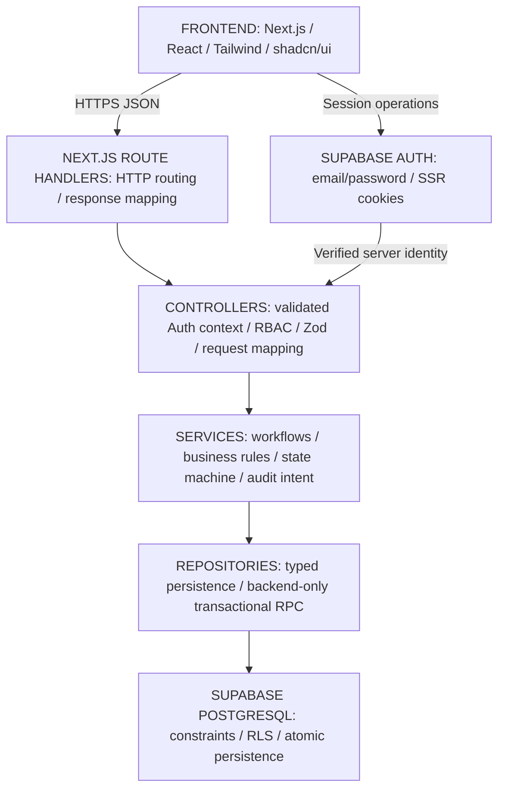

# 14 - Architecture decisions and approval register

Classification follows [00](00_PROJECT_CHARTER.md). Assessment source: the supplied six-page Webtezza challenge, sections 1-16. User sources: the original G00 request and the subsequent decision-approval table. External references validate feasibility, not add manufacturing requirements.

**Approval recorded:** 2026-10-06, Asia/Colombo, by the user in this conversation. All 26 UD directions are approved. G00/G01/G02 are committed and merged. The subsequent explicit G03 request authorizes database migrations, exact recipe seeds, remote application, generated types, and verification on a new branch; it stops before G04 and application features.

## Captured architecture decisions

| ID | Classification/status | Decision and consequence |
|---|---|---|
| ADR-001 | DESIGN DECISION, approved by user | Next.js + TypeScript; one application for UI/HTTP API. Select/pin exact compatible package versions in G01; versions do not block architecture. |
| ADR-002 | DESIGN DECISION, approved by user | Modular monolith with Frontend -> Route Handler -> Controller -> Service -> Repository. No business logic/direct queries in routes. |
| ADR-003 | DESIGN DECISION, approved by user | Supabase PostgreSQL/Auth; no Prisma/Auth.js. auth.users is authentication authority; public.profiles owns application user/role data; no duplicate password hash. |
| ADR-004 | DESIGN DECISION, approved by user | Server RBAC plus Supabase RLS defense. One factory/no tenancy; role-permitted visibility, no creator-owned filtering. |
| ADR-005 | DESIGN DECISION, approved by user | Browser Supabase for Auth/session; privileged business operations through backend layers. Elevated secrets remain server-only with additional guards. |
| ADR-006 | DESIGN DECISION, approved by user | Zod input validation plus independent service rules. Positive integer target, nonnegative integer counts, positive fabric up to three decimal places. |
| ADR-007 | DESIGN DECISION, approved by user | Critical transitions use backend-only PostgreSQL transaction/RPC. Approval rereads authoritative DB counts and atomically commits immutable sign-off/VERIFIED. |
| ADR-008 | DESIGN DECISION, approved by user | Tailwind/shadcn/ui, Vitest/Playwright, Vercel. Light responsive desktop-first UI, text+color status, visible focus/errors; no dark mode required. |
| ADR-009 | APPROVED EXTENSION | SYSTEM_ADMIN manages production users/roles and administrative audit only; never production or impersonation. |
| ADR-010 | DESIGN DECISION, approved by user | One protected role/user; creator can never verify their own order after reassignment; admin cannot self-assign production. |
| ADR-011 | DESIGN DECISION, approved by user | Seeded read-only recipes, frozen BOM/expectations at first submission, same-order re-cut/new attempts, recipe/target frozen thereafter. Previous attempts and audit evidence immutable; no hard deletion. |
| ADR-012 | DESIGN DECISION, approved by user | Keep VERIFIED when sewing starts; set sewing_started_at/started_by on order. No additional initial production status. |
| ADR-013 | DESIGN DECISION, implementation detail | Common row-lock/revision protocol reinforces approved transaction/authoritative-reread decisions. This is engineering detail, not a reopened architecture blocker. |
| ADR-014 | DESIGN DECISION, approved by user | Stable REST-style /api routes and JSON; wrong role 403, hard stop/invalid reason 422, state conflict 409. |
| ADR-015 | DESIGN DECISION, approved by user | G00 stays documentation only, with first commit on a new branch merged locally into main. No source/packages/migrations/G01 in this task. |
| ADR-016 | DESIGN DECISION, approved by user | Synchronous admin creation with email/full name/production role/temporary password: backend Auth create, then profile persist. If profile fails, attempt cleanup of new Auth user and return error; no async provisioning system. |

## APPROVED_DECISIONS

Historical UD IDs are retained for traceability; they no longer indicate unresolved status. These statements record the user's approved directions, including the latest admin clarification. Detailed tables, routes, bounds, and lock mechanics are implementation details within those directions.

| ID | Approved decision |
|---|---|
| UD-001 | Component/target quantities are integers; actual component count may be 0. Actual fabric is positive with at most three decimal places. Target/fabric cannot be 0. |
| UD-002 | YELLOW can proceed. The quantity gate blocks RED, missing, or uncounted required components; excess is not a failure. |
| UD-003 | Wastage cap is a warning/analytics value, never an approval gate. |
| UD-004 | Preserve signed negative fabric variance; do not clamp it. |
| UD-005 | Order begins CUTTING_IN_PROGRESS; supervisor submits to PENDING_VERIFICATION. |
| UD-006 | Re-cut reuses the same order with a new verification attempt. Recipe/target freeze after first submission; previous attempts remain immutable. |
| UD-007 | Keep production status VERIFIED; Start Sewing records sewing_started_at, started_by, and related metadata without adding another production status initially. |
| UD-008 | Recipes are seeded/read-only for assessment scope. Snapshot required BOM/expected quantities on first submission. |
| UD-009 | Single factory/plant, no tenancy. Production record visibility follows role permissions, without creator-ownership restrictions. |
| UD-010 | One role/user. An order creator cannot later verify that order even after role change. Admin cannot self-assign production privileges. |
| UD-011 | First SYSTEM_ADMIN manually bootstrapped through Supabase. Admin cannot deactivate/demote itself or create/promote another SYSTEM_ADMIN through normal UI/API. |
| UD-012 | Critical transitions, including approval, use PostgreSQL transaction/RPC invoked only through backend service/repository layers. |
| UD-013 | UUID primary keys, server-generated human order numbers, UTC storage, reasonable bounded numeric columns. Concrete formats/ranges are engineering details. |
| UD-014 | No hard deletion; users are deactivated. Approved verification and audit records are immutable; historical attempts retained under UD-006. |
| UD-015 | Supabase email/password auth, distinct real demo accounts, cookie-based SSR session, public signup disabled. |
| UD-016 | Explicit Save Counts, no autosave. Approval rereads authoritative DB values before committing. |
| UD-017 | Verifier may reject physical defects even with GREEN counts; every rejection needs a reason. |
| UD-018 | Trim reason; require nonempty/max 1000 characters; invalid reason returns 422. |
| UD-019 | Stable REST-style /api routes and JSON; wrong role 403, business hard stop 422, state conflict 409. |
| UD-020 | Select/pin exact package versions in G01; version selection does not block architecture. |
| UD-021 | image_url nullable; component name suffices when no image exists. |
| UD-022 | Admin enters email/full name/production role/temporary password; POST /api/admin/users -> AdminUserController -> AdminUserService -> Supabase Admin API creates Auth user -> public.profiles row. If profile creation fails, attempt cleanup of the newly created Auth user and return error. Synchronous creation is sufficient; no invitation/async ledger required. |
| UD-023 | Same-origin cookie auth, server-side origin protection on mutations, no-store private app data. No elaborate MVP rate-limiting system. |
| UD-024 | Four days/28-32 hours remain assessment schedule; scheduling is not an architecture blocker. Admin work stays secondary to core assessment. |
| UD-025 | auth.users owns authentication; public.profiles owns application user/role data. No duplicate password hash. |
| UD-026 | Light, desktop-first responsive UI, text+color statuses, visible focus/errors. No dark-mode requirement. |

## Logical architecture

**DESIGN DECISION (approved by user):**

Cross-cutting: validated identity, current server RBAC, strict schemas, RLS, immutable audit, database constraints, predictable errors, automated tests, same-origin protection/private no-store data. Detailed module responsibilities are in [05](05_DOMAIN_MODEL.md), atomic persistence in [06](06_DATABASE_DESIGN.md), access contexts in [07](07_AUTH_SECURITY_RBAC_RLS.md).

Services own rules; repositories execute typed persistence. Database command revalidation on locked values reinforces rules against races. It is not an alternative to service authorization or a route-level business implementation.

## Assessment interpretations and extension compatibility

The original assessment wording remains recorded; the user's approved interpretations now resolve the project ambiguities.

| ID | Assessment wording/tension | Approved project interpretation |
|---|---|---|
| C-01 | Section 11 p.5 broadly bans decimals; recipe rates/fabric analytics use decimal measures (7.1/7.5 p.3). | UD-001: discrete quantities integer; positive actual yards allowed to three decimal places. Explicit user-approved interpretation, not a silent exception. |
| C-02 | Section 3 p.1 says no mismatched batches; 7.3 p.3 explicitly permits YELLOW. | UD-002: preserve specific YELLOW allowance; quantity hard stop is RED/missing/uncounted. |
| C-03 | Seed recipes supply caps but no cap-based gate. | UD-003/UD-004: warning/analytics only; signed fabric variance retained. |
| C-04 | Sample users includes password_hash; approved Auth manages credentials and schema refinements are allowed (8 p.4). | UD-025: auth.users + public.profiles, no duplicate hash. |
| C-05 | Start Sewing required, database Sewing Queue must filter VERIFIED (7.5/9 pp.3-4). | UD-007: VERIFIED stays; server start metadata on existing order. |
| C-06 | Rejection returns for re-cut; persistence/reset mechanics not supplied (6/7.4 pp.2-3). | UD-005/UD-006/UD-008/UD-016: same order/new immutable attempts; frozen recipe/target/BOM; explicit saves and authoritative reread. |
| C-07 | Admin outside three assessment production roles can undermine separation if a superuser. | UD-010/UD-011: no production authority/self-assignment/self-deactivation/self-demotion; manual first-admin bootstrap; creator never verifies same order. |
| C-08 | Assessment calls for implementation/cloud/tests in four days; current task is documentation/version control. | G00 remains docs only; UD-020 selects versions at G01, UD-024 keeps admin secondary and removes schedule as architecture blocker. |
| C-09 | Established records are not hard-deleted (UD-014); latest UD-022 requires cleanup after failed profile creation. | Cleanup may remove only the newly created incomplete Auth identity as rollback. Existing users/profiles/production/audit remain protected; failed cleanup still returns error and missing-profile access stays denied. |

Approved Next.js/TypeScript/Supabase/Vercel fits the permitted assessment stack. Technical schema refinements preserve required relational entities. The latest admin decision replaces the earlier durable invitation proposal; neither documentation approval nor Git work claims runtime readiness.

## UNRESOLVED_DECISIONS

None. All 26 historical decisions remain approved. G01/G02 packages are pinned, and scheduling is not an architecture blocker. G03 is merged and the explicit G04 identity/access/admin request is authorized. The subsequent autonomous continuation request authorizes G05–G08 after G04 finalization, with manual user deployment only.

## G00 completion record

All fifteen documents reflect the approved decisions. Requirements, approved interpretations, implementation details, and the approved synchronous admin provisioning direction are distinguished. Documentation validation covers structure, links, example payloads, decision/test references, and cross-document consistency.

The initial documentation commit `9b9a7a3` was created on a new branch and merged locally into main as authorized. No application code, packages, migrations, database changes, cloud provisioning, deployment, root submission artifacts, or G01 work belonged to G00.

## G01 scaffold decisions

**DESIGN DECISION (implementation detail under approved UD-020):** The explicit G01 request authorizes a scaffold on `chore/g01-nextjs-scaffold`, based on G00 commit `9b9a7a3`. Existing business decisions are preserved. G01 does not authorize a Supabase connection, migrations, authentication, production APIs/features, deployment, or G02.

| ID | Concrete scaffold choice and rationale |
|---|---|
| ADR-017 | Next.js 16.3.8 stable, React/React DOM 19.3.0, App Router under src/app, default Turbopack. No Pages Router, React Compiler customization, Prisma, or Auth.js. System fonts avoid a build-time font download. |
| ADR-018 | Node 22.23.2 pinned in .nvmrc; supported project engine >=22.12.0 <23. npm 10.9.8 recorded in packageManager; engine >=10.9.0 <11. The Node floor satisfies Vitest 5 as well as Next.js. Exact direct dependency versions plus package-lock.json, save-exact, and npm ci provide reproducible installation. |
| ADR-019 | TypeScript 5.9.3 with strict, noUncheckedIndexedAccess, exactOptionalPropertyTypes, bundler resolution, and @/* -> src/*. Package type is module, including the Vitest configuration. Choose TypeScript 5 / ESLint 9 for compatibility: current Next.js React/import/accessibility plugins declare ESLint 9 support, not ESLint 10. ESLint 9.39.5 is upstream EOL; this tooling limitation is explicitly recorded rather than forcing unsupported peer versions. Next route types are generated before tsc. Lint uses Core Web Vitals/TypeScript, explicit-any rejection, and zero warnings; Prettier 3.9.9/EditorConfig define formatting while retaining approved G00 document formatting. |
| ADR-020 | Tailwind 4.3.3 with matching PostCSS plugin; shadcn 4.21.3 manually initialized using base-nova, RSC/TSX, neutral light CSS-variable theme, components.json, CSS imports, and cn 0.4.0 re-exported from src/lib/utils/index.ts. No UI components or dark-mode implementation. Zod 4.6.5 installed without speculative schemas. |
| ADR-021 | Vitest 5.0.3 runs tests/unit and tests/integration in Node, with the same @ alias and explicit test imports. Only the class utility has unit smoke coverage. Playwright 1.63.0 runs a home-page smoke test in desktop/mobile Chromium against an isolated production server; test:e2e builds first and remains separate from npm test. No business/integration tests are claimed. |
| ADR-022 | Future route groups, components, domain modules, server layers, Supabase adapters, types, and integration tests are documented in README; create each directory only when real implementation exists. Current source is root layout/page/styles and the shadcn utility. Future error concepts retain the status mapping in 08; no placeholder error framework, controllers, services, repositories, or APIs. |

The complete dependency/version inventory is authoritative in [package.json](../package.json) and its lockfile. The source tree, scripts, local setup, and future directory layout are documented in [README](../README.md).

Setup follows the official [Next.js App Router installation](https://nextjs.org/docs/app/getting-started/installation), [Tailwind Next.js setup](https://tailwindcss.com/docs/installation/framework-guides/nextjs), and [shadcn manual installation](https://ui.shadcn.com/docs/installation/manual). Public placeholder naming follows [Supabase SSR client guidance](https://supabase.com/docs/guides/auth/server-side/creating-a-client); no client is created in G01. SUPABASE_SERVICE_ROLE_KEY is documented only as server-only, never public or browser-exposed.

Security boundaries remain those in 07/12: UI is not authority; privileged APIs authenticate/authorize on the server; RLS reinforces access; repositories/Auth adapters isolate privileged clients; same-origin mutations and private no-store data apply when those routes exist; no generic production-status mutation.

### Dependency limitations

`npm audit --omit=dev` reports zero vulnerabilities. Full `npm audit` reports nine high-severity findings propagated through development-only Next.js lint and shadcn CLI dependencies from braces 3.0.3. The [upstream advisory](https://github.com/advisories/GHSA-vfj7-8cjw-p6xm) lists no patched version. Do not use audit's suggested major downgrades to obsolete Next.js/shadcn tooling, suppress the finding, or claim a clean full audit. Recheck when an upstream fix is available.

[ESLint's support policy](https://eslint.org/version-support/) marks version 9 EOL. Current eslint-plugin-react/import/jsx-a11y peer declarations do not include version 10; retain compatible tooling rather than forcing unsupported peers. Revisit when the Next.js plugin stack supports ESLint 10. Neither limitation changes a business rule or prevents the scaffold checks from running.

### G01 completion evidence

Verified locally on 2026-10-06 using Node 22.23.2/npm 10.9.8. These checks cover only the scaffold, not the future production acceptance cases:

| Check | Actual result |
|---|---|
| npm install; fresh npm ci | Both succeeded; lockfile matches all 21 exact direct dependency pins. Recorded audit/EOL limitations above remain. |
| npm run typecheck | Passed Next.js type generation and strict tsc with no errors. |
| npm run lint | Passed with zero errors/warnings. |
| npm test | One Vitest file, two class-utility tests passed; no browser launch. |
| npm run format:check | Passed for all scaffold files; existing numbered-document formatting preserved. |
| npx shadcn info | Recognized Next.js/src/RSC/TypeScript/Tailwind 4/base-nova and all aliases; no UI components installed. |
| npm run test:e2e | Production build passed; desktop/mobile Chromium smoke tests both passed. Initial run preceded completion of browser download and failed launch; after installation, direct Playwright rerun and full test:e2e rerun passed. |
| Production boot | Playwright-owned next start server returned HTTP 200; home content/title visible, no horizontal overflow or browser page errors on both viewport sizes. Server stopped after tests. |
| npm audit --omit=dev | Zero production vulnerabilities. Full audit has nine development-only high findings; not represented as a clean audit. |
| Scope/link/Git review | All fifteen docs retained, twelve unchanged; local Markdown links valid; no business APIs, Supabase wiring, secrets, migrations, fake auth, or placeholder files. git diff --check passed. |

At the end of the original G01 turn, the branch contained 23 new scaffold/configuration/test files and modifications only to documents 00, 13, and 14; no commit, merge, push, deployment, or G02 had been performed then. No blocking scaffolding decisions or failed required checks remained.

### Subsequent G01 merge

The user committed G01 as 8bc0103a6b7fd325601918af131b700d5e8904b5. Their subsequent G02 request explicitly authorized creating and merging the previous PR first. [PR #1](https://github.com/SMS123456789/apparel-flow/pull/1) was created and merged on 2026-10-06, producing main merge c8ec89bc958bb2ec1d45d227e49148ad6d798c7f. Local main and chore/g02-supabase-foundation were fast-forwarded to that merge; G01 history was preserved.

## G02 Supabase foundation decisions

**DESIGN DECISION (implementation detail under the explicit G02 request):** Infrastructure is implemented on chore/g02-supabase-foundation, based on the G01 merge. Approved manufacturing/admin decisions are unchanged. No G03 schema, auth feature, RBAC/RLS policy, business API, seed, user creation, deployment, or cloud mutation belongs to G02.

| ID | Concrete infrastructure choice and rationale |
|---|---|
| ADR-023 | Exact application pins: @supabase/supabase-js 2.117.2, @supabase/ssr 0.12.7, server-only 0.0.1. Development pins: supabase CLI 2.119.0, @next/env 16.3.8 matching Next, and tsx 4.23.15 for the TypeScript diagnostic script. npm ci and the existing Node/npm conventions remain authoritative. |
| ADR-024 | Split Zod environment validation: public URL/publishable key only, separate server-only SUPABASE_SECRET_KEY. Reject privileged keys in the public field; strip unrelated fields; report invalid/missing variable names without values. Validate lazily so home/offline checks need no live credentials. Legacy anon/service_role values map to the current public/secret variables without becoming user-identity authority. The configured ignored .env legacy variable was renamed locally, preserving its value. |
| ADR-025 | Browser factory uses SSR createBrowserClient and only public configuration. Async server factory awaits cookies(), creates one user-context client per request, writes cookies, and forwards SSR cache headers to the caller's Headers. The caller must include those headers in its response. Cookie-write errors propagate; writable Route Handler/Server Action use is supported. Read-only rendering and refresh proxy integration wait for G05 because no authenticated pages/session workflow exists yet. |
| ADR-026 | Privileged factory and server env import server-only. Privileged auth persistence, refresh, and URL-session detection are disabled. Both server factories fetch with no-store. Elevated access is reserved for future authorized backend adapters/repositories; it does not grant application roles or replace service authorization/RLS-scoped reads. No factory is invoked by the current home page. |
| ADR-027 | CLI-generated supabase/config.toml establishes a cloud-first migration workflow. Every application schema change must have version-controlled SQL; review migration state and dry-run before a separately authorized push. No fake migration/directory, SQL, seed, or Database type is created. Optional local Docker stack is not adopted in G02. Local config disables signup, seeds, and implicit table exposure; PostgreSQL 17 is the generated default and must match cloud before local migration tests. Local config does not change cloud Auth settings. |
| ADR-028 | npm run supabase:check uses Next env loading, public-key GET Auth health, privileged-key GET Data API OpenAPI metadata, and one read-only SDK Auth user-list call. It prints only controlled status/variable-name errors, never bodies/users/credentials. No public health route, tables, records, users, schema mutations, or RLS weakening. CLI login/linking and generated types remain future operator/G03 work. |

Implementation follows current primary guidance: [SSR factories/cookies](https://supabase.com/docs/guides/auth/server-side/creating-a-client), [API-key terminology and legacy mapping](https://supabase.com/docs/guides/getting-started/api-keys), [SDK client initialization](https://supabase.com/docs/reference/javascript/initializing), [CLI setup](https://supabase.com/docs/guides/local-development/cli/getting-started), and [migration workflow](https://supabase.com/docs/guides/deployment/database-migrations).

The initial public-key OpenAPI probe received HTTP 401. Supabase's [current OpenAPI access change](https://supabase.com/changelog/42949-breaking-change-removing-access-to-openapi-spec-via-the-anon-key) requires a secret/service credential for that metadata endpoint. The trusted diagnostic now uses that supported credential, while Auth health retains the public key. This is an infrastructure read, not a production data/RLS bypass or an architecture change. All three real checks then passed without displaying returned data.

No business-rule or architecture deviations were introduced. CLI operator login/linking is not configured, and no local Docker stack is available; these optional workflows do not block the verified cloud API foundation. G03 remains separately authorized work.

### G02 completion evidence

Verified locally on 2026-10-06 using Node 22.23.2/npm 10.9.8. Infrastructure unit tests use mocks/synthetic configuration and do not call the live project. The separate diagnostic uses the configured ignored environment.

| Check | Actual result |
|---|---|
| npm ci | Passed fresh installation; all 27 exact direct pins match lockfile. Existing development-only audit/EOL limitations remain. |
| npm run typecheck | Passed Next.js route generation and strict TypeScript without errors. |
| npm run lint | Passed with zero errors/warnings. |
| npm run format:check | Passed all matched files; numbered-doc formatting preserved. |
| npm test | Three files, 24 tests passed: two existing class-utility tests and 22 environment/factory cases. Initial malformed URL test exposed a raw URL-parser error; validation was fixed and the complete suite rerun successfully. |
| npm run test:e2e | Production build and both desktop/mobile Chromium home tests passed. Production server returned HTTP 200 with no page errors/overflow and stopped after tests. |
| npm run build | Separate final production build passed; only home and not-found routes exist. |
| npm run supabase:check | Auth health HTTP 200; privileged Data API OpenAPI metadata HTTP 200; privileged SDK Auth read succeeded. No response bodies/users displayed and no mutations performed. |
| Supabase CLI/config | Version 2.119.0 and actual command help verified; config parses, migration support enabled, signup/seeds/implicit table exposure disabled. No SQL files. Local status returned exit 1 because Docker is unavailable; whoami returned exit 1 because operator login is not configured. No start/link/push/reset executed. |
| Browser/server guard | Temporary Client Component importing the privileged factory made Next.js reject server-only imports as expected; probe removed before final build/tests. Unit mocks do not weaken the actual build safeguard. |
| Credential audit | .env/.env.local ignored and untracked; .env.example placeholders only. Configured server key/database password absent from all trackable files, Git diff, and 45 generated JavaScript files; nine browser JavaScript files contain no secret-variable references. No elevated secrets logged. |
| npm audit --omit=dev; full audit | Production audit passed with zero vulnerabilities. Full audit still reports nine high development-tooling findings inherited from G01; not claimed clean. |
| Scope/docs/Git | README and all fifteen numbered documents have valid local links/anchors. No business calls/APIs/tables, auth feature/proxy, fake sessions/roles, generated Database type, or placeholder migrations. git diff --check passed. |

At the end of the original G02 turn, eleven new files and ten modified files remained uncommitted. The ignored .env update was excluded. All required checks passed: **G02 COMPLETE — READY FOR G03**, stopping before schema/auth/business implementation. The user's subsequent merge request authorized commit fff5167 and [PR #2](https://github.com/SMS123456789/apparel-flow/pull/2), merged into main as 0ec487941f3e16bd44fb888c4bc164b1f281d1e9 before G03.

## G03 database foundation decisions

**DESIGN DECISION (implementation detail under the explicit G03 request):** Work is on feat/g03-database-schema, based on the G02 merge. G03 includes the assessment seeds originally listed separately at G04 in the roadmap. Its request permits stronger documented equivalents, so order_components, OPEN attempts, separate immutable verification_log_items, and sewing start fields on cutting_orders are preserved. No business decision, role, production status, or approval gate was changed.

| ID | Actual schema/tooling decision and rationale |
|---|---|
| ADR-029 | Three version-controlled migrations: 20261006153000_apparelflow_domain_schema, 20261006153100_assessment_recipes, and forward 20261006155500_rejection_reason_whitespace. All applied through Supabase CLI --db-url after isolated validation and remote dry-run. Existing configured database password passed only via PGPASSWORD; no Management API token/login, Dashboard DDL, history repair, or shared reset needed. Cloud is PostgreSQL 17.11; local config already uses major 17. |
| ADR-030 | Ten tables, six enums, 21 restrictive FKs, 51 CHECK constraints, and 44 indexes. UUID identities preserve historical references; verification_log_items uses its documented natural UUID pair. Composite keys/FKs enforce source-recipe membership, same-order attempts/sign-offs, same-attempt count evidence, expected-count basis, and APPROVED log references. Private bounded sequence generates twelve-digit AF- numbers. No cascading evidence deletion or password hash. |
| ADR-031 | Bounded numeric plus scale checks preserves the documented numeric(12,3)/(24,3)/(32,12) value/precision limits while rejecting excess input scale before PostgreSQL silently rounds it. This is a storage refinement under UD-001/UD-013, not a business-rule change. Count/revision bigint bounds stay within JavaScript safe integers. Signed generated component variance and signed fabric wastage remain representable; caps never gate approval. |
| ADR-032 | Seven private invoker trigger helpers, empty search_path and qualified relations; 26 triggers enforce no deletes, immutable references/BOM/audit, first-submit recipe/target freeze, finalized attempt/count/sign-off protection, verified order facts, one-time sewing attribution, stable identities, and reusable mutable-row updated_at. New log/item evidence must be inserted while the attempt is OPEN before finalization in the future transaction. No approval/rejection/role/state-transition RPC was introduced. |
| ADR-033 | RLS enabled on every application table, zero policies, no PUBLIC/anon/authenticated table privileges. service_role has SELECT only and no direct DML/TRUNCATE. Private schema/helpers/sequence are inaccessible to API roles. Role-based read policies and reviewed transactional commands are later milestones; ordinary access intentionally remains denied. |
| ADR-034 | Deterministic idempotent migration supplies only REC-BL01/REC-CT02 and the exact ten components, with null images. Replay verifies the fixed catalog rather than overwriting mismatches. Recipes/components are read-only even for ordinary privileged updates. No cloud Auth users/profiles/orders/attempts/sign-offs/sewing/admin fixtures are created. |
| ADR-035 | Supabase CLI generates src/types/database.generated.ts from the real public schema and automatically formats it with existing Prettier. Definitions are never hand-edited; all three factories bind Database. Generated helper definitions are excluded from authored-code ESLint rules but remain strict-typechecked and format-checked. Type generation writes atomically only after success/credential checks. PostgreSQL password tooling is separate from app client configuration. |
| ADR-036 | Separate npm run test:db creates a disposable PostgreSQL 17 Docker container with no network/host ports, runs actual migrations, replays seeds, checks catalog/grants/RLS, and tests constraints/immutability with rollback-only fixtures. Minimal local Auth FK/role infrastructure is test-only, not application Auth or a mock claim of Supabase login correctness. Cloud verification is read-only. Existing Vitest/Playwright remain separate and unchanged in scope. |

Current primary references: [PostgreSQL numeric coercion](https://www.postgresql.org/docs/17/datatype-numeric.html), [relational constraints](https://www.postgresql.org/docs/17/ddl-constraints.html), [Supabase database connections](https://supabase.com/docs/guides/database/connecting-to-postgres), and [CLI type generation](https://supabase.com/docs/guides/api/rest/generating-types). The CLI's supported flag help was also inspected. Docker's selected desktop context was unavailable, but the existing default Engine works; type generation uses DOCKER_HOST=unix:///var/run/docker.sock without changing the user's global context. The full local Supabase stack is not adopted.

The first isolated catalog run exposed name[] versus text[] comparison in enum assertions; casting enum labels to text fixed the verification script. Migrations themselves applied cleanly to isolated PostgreSQL, seed replay passed, and the full isolated suite then passed. A later metadata-shape refinement was validated again before cloud application. Applied migrations are not edited after remote execution.

Final review found that PostgreSQL's default btrim removes ordinary spaces only. A regression using a tab/newline-only rejection reason actually failed before the fix because the database accepted it. Forward migration 20261006155500 adds a CHECK matching the full ECMAScript String.trim whitespace set, preserving the approved trimmed 1–1000-character rule and the original migration history. The complete isolated suite passed with tab/newline, leading nonbreaking-space, and trailing byte-order-mark regressions. The forward migration was then applied through the reviewed CLI workflow; generated types were regenerated from cloud and their hash remained unchanged because this fix changes a constraint only.

### G03 completion evidence

Verified on 2026-10-06 with the existing Node 22.23.2/npm 10.9.8 and Supabase CLI 2.119.0 pins. SQL mutation tests run only in disposable PostgreSQL 17; cloud schema/history verification is read-only.

| Check | Actual result |
|---|---|
| npm ci | Fresh install passed; 27 exact direct dependency pins and lockfile unchanged. Existing development-tooling audit/EOL limitations remain. |
| npm run typecheck; npm run lint | Strict TypeScript and lint passed with no errors or warnings; all three Supabase factories use the generated Database type. |
| npm run format:check | Passed all matched files, including generated types. Approved numbered-document formatting retained. |
| npm test | Three Vitest files, 24 existing scaffold/infrastructure tests passed. |
| npm run test:e2e | Production build and both desktop/mobile Chromium smoke tests passed; HTTP 200, no page errors or horizontal overflow; owned server stopped. |
| npm run build | Separate production build passed; only home and not-found routes exist. |
| npm run test:db | All three actual migrations, idempotent seed replay, catalog/grant/RLS checks, positive structural/history cases, and 56 expected-error assertions passed. Test fixtures rolled back; isolated container removed. The earlier assertion-type and whitespace regression failures are recorded above. |
| CLI remote plan/push/list | All three versions applied and local/remote history matches exactly. Final dry-run reports no pending migrations. No Dashboard DDL, history repair, reset, or login workaround. |
| npm run supabase:schema:verify | Cloud PostgreSQL 17.11: ten tables, six enums, 21 restrictive FKs, 51 CHECKs, 44 indexes (18 purposeful beyond PK/unique constraints), 26 triggers, and seven private invoker helpers. All ten tables have RLS and zero policies; API grants match default-deny design. |
| npm run supabase:types | Supported CLI generated actual cloud public-schema types; automatic formatting and atomic replacement succeeded. Regeneration after the forward fix produced the same type-file hash. |
| Seed/data verification | Exactly REC-BL01/REC-CT02, matching assessment values and five exact components each; all images null. Zero cloud Auth users/profiles/orders/attempts/verification logs/admin events. No production fixtures created. |
| npm run supabase:check | Current Auth health and privileged REST metadata returned HTTP 200; read-only privileged Auth SDK call succeeded. No returned user/body data printed. |
| Security audit | Private environment files ignored/untracked; example placeholders only. Real configured credentials absent from trackable files/Git diff and 92 generated JavaScript files; nine browser JavaScript files contain no server-secret-variable references. Server-only guards retained; no client business database calls, application APIs/Auth features, permissive policies, direct mutation grants, or workflow RPCs introduced. |
| npm audit --omit=dev | Zero production vulnerabilities; nine high development-tooling findings inherited from G01 remain documented, not claimed clean. |
| Scope/docs/Git | Actual ERD, tables/enums, index/trigger rationale, deletion/grant posture, scripts, seeds, and generated-type workflow documented. Local Markdown links/anchors and whitespace checks passed. Nine new G03 files and thirteen modified files remain uncommitted on feat/g03-database-schema. The separately added AGENTS.md and docs/15_UI_DESIGN_SYSTEM.md were preserved without edits. |

No business-rule or architecture deviations and no blockers remain. Bounded numeric scale checks are the documented storage refinement needed to reject overprecision rather than round it. Stronger existing model equivalents are preserved within the explicit G03 request. No new dependency, feature UI, auth flow, role service, business API/service, or approve/reject RPC was added. No G03 commit, push, PR, merge, or G04 work has been performed. **G03 COMPLETE — READY FOR G04.**

### Subsequent G03 merge

The user explicitly requested a PR merge including UI design docs. Commit 178810988a80644fb4afa458b4f8f921c62977de includes G03 plus AGENTS.md/docs/15_UI_DESIGN_SYSTEM.md. [PR #3](https://github.com/SMS123456789/apparel-flow/pull/3) merged into main as 97da2e75e8572ca539eccd78f761357c90faadee on 2026-10-06. G04 began from that clean merged baseline.

## G04 identity access admin decisions

**DESIGN DECISION (explicit G04 request):** Work is on feat/g04-identity-admin. The approved layered architecture and all business rules remain. G04 contains authentication/access/admin only and stops before cutting/BOM/count/gate/sewing features. The user authorized generation of private admin credentials in ignored .env.local and confirmed disabling public signup; the cloud Auth setting was independently verified.

| ID | Actual implementation and rationale |
|---|---|
| ADR-037 | Supabase password authentication through thin /api/auth routes, AuthController/AuthService/AuthRepository and ProfileRepository. Verified getUser subject plus own active profiles row produces only id/email/fullName/role/isActive. No getSession or editable metadata authority. Exact role guards have no hierarchy; current profile is reloaded each protected request. |
| ADR-038 | Next.js 16 src/proxy.ts verifies getClaims/refreshes SSR cookies and handles coarse unauthenticated page redirects only. Both request/response cookies and refresh/cache headers propagate, including redirects. APIs independently guard identity/role. HttpOnly/SameSite=Lax/Secure-on-HTTPS cookies, exact APP_ORIGIN mutation checks and private,no-store responses. Server Component clients are explicitly read-only; writable route cookie errors propagate. |
| ADR-039 | Small typed error model with one JSON translator: 400 format, 401 Auth, 403 authority/activity, 404 missing, 409 revision/duplicate/state, 422 validation/business, sanitized 500 and dependency 503. Strict Zod shapes reject actor/authority extras. All responses use server request IDs; raw SQL/provider errors and secrets stay out of logs. |
| ADR-040 | Three allowlisted demo persona buttons authenticate real distinct accounts using server-only private configuration. Previous local session is signed out, current Auth/profile verified and expected production role checked before full navigation. No fake role switch or client storage authority. SYSTEM_ADMIN is absent from public demo UI. Four protected shells display real identity; only admin users/audit has feature UI in G04. |
| ADR-041 | Admin controller/service guard SYSTEM_ADMIN for list/search/create, role/activity changes and audit. Supabase Admin Auth creates an email-confirmed identity; a single database command creates profile plus immutable audit. Failed persistence checks whether a profile committed before safe new-identity-only cleanup. Committed/unknown outcomes return a controlled uncertainty error, absent profile triggers cleanup; duplicate established identities are never deleted. No invitation/background/mandatory-reset system. |
| ADR-042 | Forward 20261006163000_identity_admin_access migration adds one own-active profiles SELECT policy and four service_role-only public invoker gateways. Four private definer commands have empty search_path and a restricted NOLOGIN/NOINHERIT/BYPASSRLS owner with profile SELECT/INSERT/limited UPDATE and admin audit SELECT/INSERT only. Actor/target locks and current admin/revision rechecks protect role/activity updates; audit failure rolls back data. No API direct DML, production privileges, owner role inheritance or trigger/sequence access is granted. |
| ADR-043 | Forward 20261006170000_identity_auth_projection supplies a private security-barrier view of Auth id/email, owned by the existing operator and readable only by the identity command owner. Managed Supabase postgres cannot grant Auth schema usage; this projection avoids broad Auth grants and email duplication in profiles. The command owner has no direct Auth schema/column access; temporary private CREATE is revoked after command replacement. |
| ADR-044 | Operator-only bootstrap-users verifies signup disabled, handles existing identities idempotently without password reset, checks existing credentials before attaching profiles, creates the initial admin in an operator transaction guarded by advisory lock and absence of prior admins, and creates three demo profiles through the same admin gateway. All four real sign-ins and a repeated bootstrap were verified. Strong random passwords are in ignored mode-0600 .env.local only; SQL contains no passwords. |
| ADR-045 | No new dependency or version changes. Unit/service/controller tests isolate cloud dependencies, disposable PostgreSQL 17 runs actual migrations/grants/RLS/audit rollback under a non-superuser operator, and Playwright uses real cloud identities. Browser traces are off and private password sign-in uses sanitized transport. Temporary demo role/activity mutations are restored in finally blocks and preserve append-only audit. UI follows document 15 with native dialogs and actual responsive/contrast/keyboard checks. |

Primary integration guidance: [Supabase SSR](https://supabase.com/docs/guides/auth/server-side/creating-a-client), [SSR security/refresh considerations](https://supabase.com/docs/guides/auth/server-side/advanced-guide), [Next.js Proxy convention](https://nextjs.org/docs/app/api-reference/file-conventions/proxy), [Supabase Admin createUser](https://supabase.com/docs/reference/javascript/auth-admin-createuser), and [PostgreSQL role attributes](https://www.postgresql.org/docs/17/sql-createrole.html).

### G04 actual failures and fixes

The first remote identity migration failed because EXECUTE grants followed transfer to a NOINHERIT function owner under managed non-superuser postgres. The transaction rolled back: migration history, gateway and owner-role absence were verified before changing the unapplied migration to grant before ownership transfer. The isolated runner now emulates a non-superuser operator. The reviewed migration then applied successfully.

The first demo profile command failed with permission denied for schema auth. The managed operator had Auth schema usage without grant option; GRANT emitted a warning without granting the command owner access. The newly created incomplete demo Auth identity was safely removed. Applied SQL was preserved; the forward private id/email view migration corrected the boundary. Tests emulate the managed namespace restriction and verify the command owner has no direct Auth access. All four profiles and real sign-ins then succeeded, including bootstrap replay.

Initial lint exposed effect-driven synchronous state updates, JSX escaping and relative-navigation/type-import issues. Promise callbacks and cancellation generation prevent stale user-list results without effect-driven state updates. Browser accessibility review found that timer-based validation focus could run before React committed the error; login/admin error focus now runs in an effect after rendering. It also demonstrated that native dialog Tab traversal could leave page focus at browser chrome; explicit first/last Tab wrapping keeps focus in the visible enabled dialog controls. Disabled-hover styling and dirty dismissal focus were refined. The review initially used an ambiguous alert locator (including Next.js route announcer) and assumed Cancel was the last dialog button; those test selectors were corrected to the actual UI. Repeated real mutation runs moved bootstrap creation events beyond the first audit page. The browser test had incorrectly assumed a creation event would always be on page one; it now checks actual event details and next/previous pagination without depending on event age. Checks were rerun rather than suppressed. Historical G03 failures remain recorded above.

### G04 completion evidence

Verified on 2026-10-06 using existing Node 22.23.2/npm 10.9.8 and all 27 unchanged exact package pins. Mocked unit/controller tests, isolated real SQL and live Auth/browser results are distinguished below. No G04 commit, PR, merge or deployment was performed. G05 remains unstarted.

| Check | Exact final result |
|---|---|
| npm ci | Fresh install succeeded; lockfile/pins unchanged. Inherited ESLint 9 EOL/development-only audit limitations remain recorded under G01. |
| npm run typecheck | Next route generation and strict TypeScript passed. |
| npm run lint | Zero errors/warnings. No lint suppression added for effect updates. |
| npm run format:check | All matched files passed; approved numbered-doc formatting intentionally preserved by existing ignore rules. |
| npm test | Seven files, 112 tests passed. Login/demo strict shape, exact-role guard matrix, profile resolution/inactivity, session replacement, synchronous creation/cleanup/uncertainty, self/promotion guards, revisions, real route/controller response mapping, origins/no-store and Proxy cookies. External Auth/DB adapters are mocked here. |
| npm run test:db | All five actual migrations, exact seed replay, catalog/owner/grants/RLS checks, immutable domain cases and 75 expected-error assertions passed (56 existing domain, 19 identity/admin). Real injected audit failures roll back creation and status/revision. Disposable PostgreSQL 17 has no external network/ports; rollback fixtures and owned container removed. |
| npm run test:e2e | Production build and 17 Playwright cases passed: eight required desktop journeys, eight mobile journeys and one explicit viewport/contrast/keyboard review. One duplicate mobile viewport case is deliberately skipped because the desktop review already runs all four specified widths. Real sessions, role isolation, API denials, persona replacement/logout, actual SSR cookie refresh, private admin dialogs/audit pagination, live role/deactivation/RLS checks and restoration passed. The owned production server stopped. Earlier actual failures/test assumptions and fixes are recorded above. |
| UI review | 1280/768/375/320 widths reflow without page overflow; tables scroll within labelled keyboard-accessible regions. Measured input/button/search/select text meets 4.5:1 and control boundaries 3:1 for reviewed default/focus/invalid/readonly/disabled/hover states, including disabled hover. Error focus, native dialog first/last keyboard wrapping, Escape/focus return and dirty discard are checked. Desktop/mobile login/admin and narrow dialog screenshots were visually inspected. This is G04 screen evidence, not a full future-system WCAG conformance claim. |
| npm run build | Separate final production build passed with protected role/admin pages, login, eight API route files and Proxy. No manufacturing routes. |
| Operator bootstrap | Four real identities/profiles provisioned; initial admin and three production personas all passed actual Supabase password sign-in. Repeated bootstrap passed without resetting passwords, changing identities or adding rows. The final replay after browser mutations confirms all expected roles/names remain active. |
| Cloud settings | Public signup independently verified disabled. Application signup endpoint is absent. The Data API refuses app_private even with the trusted service credential (406/PGRST106); private view/commands are unexposed. |
| Remote migrations/catalog | Five history versions match local SQL; final plan has no pending migration. PostgreSQL 17.11, ten tables, six enums, 21 restrictive FKs, 51 CHECKs, 44 indexes, 26 triggers, one scoped own-active policy and four backend admin gateways. No direct API DML/production-owner permission added. |
| Final cloud data | Two exact recipes/ten components, four Auth users/four active profiles and 38 immutable administrative events. The additional audit events are genuine reversible browser role/activity checks. Zero cutting orders, verification attempts or logs; no manufacturing fixtures. |
| Generated types/connectivity | Supported CLI generated actual public-schema types, automatically formatted and atomically written. Auth health/REST metadata HTTP 200 and read-only SDK Auth inspection passed. |
| Security/audit | Six configured private values absent from trackable files, Git diff and generated JavaScript; browser bundles contain no private credential variable references. .env/.env.local ignored/untracked; .env.local mode 0600. Public panel receives persona IDs only; no privileged/browser business client call, fake role storage, trusted actor payload, permissive RLS policy or production command exists. |
| npm audit --omit=dev | Zero production vulnerabilities. The nine inherited high development-tooling findings and ESLint EOL limitation remain documented rather than represented as clean. |
| Documentation/Git | README and relevant roles/database/security/API/UI/admin/test/rules/charter docs updated. Chunked G04–G08 roadmap preserves the original G00–G28 table. Local Markdown links/anchors and git diff --check passed. 24 modified and 53 new files (77 total) on feat/g04-identity-admin, all uncommitted. No deleted files; lockfile and applied G03 migrations unchanged. |

Changed files are grouped under src/app (login/role pages and thin APIs), src/components (login/shell/admin UI), src/modules (identity/admin types and schemas), src/server (auth/controllers/services/repositories/HTTP), src/lib/http, src/proxy.ts, the two forward Supabase migrations/identity tests, scripts/bootstrap-users.ts/operator tooling, unit/integration/browser tests, README and numbered docs 00/03/06–14. Current Git status is the authoritative file inventory.

No business-rule/architecture deviations or blockers remain. The private Auth projection is the narrow forward adjustment required by managed Supabase permissions; the approved synchronous Auth/profile compensation flow is preserved. Cutting creation, BOM multiplication, verification/count/traffic-light UI, approve/reject and Sewing Queue are not implemented. **G04 COMPLETE — READY FOR G05.**

## Autonomous continuation authorization

The user requested inspection and finalization of existing G04, followed by sequential G05–G08 implementation, checks and bounded feature-branch PR merges. This supersedes historical milestone stop wording. Production deployment, Vercel project configuration and DNS changes remain outside authorization. All approved business/security/UI contracts remain unchanged.

G04 continuation audit found complete but uncommitted implementation on feat/g04-identity-admin based on main 97da2e7. A fresh npm ci, 112 Vitest tests, typecheck/lint/format, isolated five-migration SQL suite, remote catalog/history and idempotent four-account bootstrap passed. Signup is disabled; no manufacturing records existed. Six private values were absent from 113 repository files and 297 generated JavaScript files; .env.local remained ignored with mode 0600. Production dependency audit returned zero vulnerabilities. Browser/build results are recorded with finalization below.

G04 continuation browser run passed 17 cases with one duplicate explicit-viewport skip. The separate production build passed. Git whitespace review passed. G04 is ready for commit and PR merge; remaining manufacturing work is authorized by the continuation.

## G05 cutting workflow decisions

G04 finalized as commit 5cc1472, merged through PR #4 into main 9a818fb. G05 runs on feat/g05-supervisor-workflow. Forward migration 20261006180000 adds JWT-scoped cutting reads and four backend-only create/edit/submit/recut gateways. Their separate NOLOGIN/NOINHERIT production owner has no Auth/admin-audit permissions or profile role/activity writes. UPDATE(id) is granted only to permit PostgreSQL row locks on profiles/attempts; identity/history triggers prohibit changing those IDs. Commands recheck active exact role and order revision under locks. Direct API-role DML remains denied.

First submission freezes all five manifest rows and expectations before setting first_submitted_at, then creates an OPEN attempt with all five uncounted items in the same transaction. Re-cut preserves prior evidence and frozen target/recipe, and resubmission takes standard/cap from the first attempt while capturing replacement fabric. Services implement state/basis rules independently. Integer thousandths/BigInt preserve expected-fabric arithmetic without float rounding; generated database types are CLI output from the applied public schema. Frontend reuses the shared native confirmation dialog and existing UI tokens.

Actual implementation fixes: isolated first-submit tests exposed missing UPDATE privilege needed for an existing trigger's SELECT FOR UPDATE on verification_attempts. Added the narrow UPDATE(id) grant before migration application; full SQL suite then passed. Typecheck identified a nonexistent direct order-to-log FK in the initial nested projection; history now follows the real order → attempts → logs relationship. ES2017 compilation rejects BigInt literal syntax, so constructors preserve the existing target and exact arithmetic. No business/security requirement changed.

Fresh G05 validation: 154 Vitest tests passed; six-migration disposable PostgreSQL suite including real cutting/recut/RLS/submission-failure rollback passed; remote migration plan/push/history/catalog and generated types passed. Typecheck/lint/format passed. Final browser/build results follow. Primary guidance: [Supabase RLS](https://supabase.com/docs/guides/database/postgres/row-level-security), [database functions](https://supabase.com/docs/guides/database/functions), [PostgreSQL locks](https://www.postgresql.org/docs/17/explicit-locking.html).

Browser review caught an actual mobile layout defect: the BOM table's intrinsic minimum width widened a grid child/form, causing page expansion and unreliable pointer coordinates. The shared form grid now uses minmax(0,1fr), children have min-width:0 and only the labelled table region scrolls. Overflow checks compare document scrollWidth with clientWidth rather than mobile window.innerWidth, which may expand with overflow. Both real desktop/mobile cutting journeys passed after this correction, including immediate errors, edit, frozen submission and refresh. The first browser test also issued a wrong-role API call before persona sign-in completed; it now waits for the authenticated workspace before asserting 403. No force-click or test suppression was added. Screenshots were visually inspected. Seven configured private values were absent from 140 repository files and 378 generated JS files (17 browser files).

Final G05 regression passed 19 Playwright cases with one duplicate viewport skip, plus production build, 154 Vitest tests, typecheck/lint/format and git diff --check. All six migrations match cloud. The six-migration isolated SQL suite and narrow owner/grant catalog assertions passed. G05 is complete and ready for PR merge; G06 follows automatically. E2E-CUTTING assessment fixtures are intentionally retained under the no-hard-delete rule.

## G06 verification implementation

Verifier reads use current user JWT/RLS and permit submitted queue/history only.
Counts are an explicit unique subset of strict nonnegative safe integers; blank
remains null, and a saved zero is RED against every positive expectation. The
service compares every frozen manifest row against saved items independently of
stored colors. SQL repeats the complete gate under profile/order/attempt locks.
Named backend-only save/approve/reject gateways have restricted NOLOGIN owner
commands, pinned search paths, no generic status input and no admin inheritance.

Approval/rejection writes log, component evidence, closed attempt and order state
in one transaction. Creator separation survives reassignment. Sign-off retains
verifier name/ID, server timestamp, count variances and signed fabric percentage;
cap excess is informational. The invoker verification_evidence view transports
NUMERIC values as text while retaining the log table's RLS. Re-cut keeps finalized
evidence and submits a fresh uncounted attempt.

The seven-migration SQL suite passed GREEN/YELLOW, zero/uncounted/missing/empty
hard stops, strict rejection reasons, inactive/wrong-role/creator guards and
injected audit failure rollback. Real simultaneous PostgreSQL connections proved
one commit and one stale conflict for dual approvals, count versus approval and
reject versus approval. 196 Vitest cases pass, including explicit ASMT-01–04
through real routes/controllers/services with persistence adapters mocked.

Typecheck caught Zod's optional-property output conflicting with exact optional
properties in the violation DTO. Mapping optional component IDs explicitly fixed
it without weakening compiler settings. Browser validation and final review are
recorded below after completion.

Real cloud desktop/mobile Playwright journeys passed saved zero reload, direct
shortage approval 422, empty-reason 422, authority injection 422, keyboard reason
validation, rejection, supervisor re-cut/resubmit, fresh null counts, explicit
Save Counts, YELLOW approval, unchanged prior evidence and repeated approval 409.
The first new test used a role body instead of the existing demo API's persona
body and correctly received 422; the test helper was corrected to the documented
contract. Verifier desktop/mobile screenshots were inspected: readable controls,
text/icon outcomes and horizontal scroll confined to labeled tables. Typecheck,
lint, format, build, cloud catalog/history and the private-value scan pass.
E2E-VERIFICATION/E2E-RECUT fixtures remain as attributable no-delete history.

Final G06 full Playwright regression: 21 passed, one duplicate viewport review
skipped. All required checks passed before committing. G05 was merged by PR #5,
main 3845efa; G06 is complete and proceeds to merge and G07.

## G07 sewing and system hardening

G06 was merged as PR #6, commit 380afce, main 349ab61. G07 adds a
security-invoker sewing_batches projection with a fixed VERIFIED predicate,
approved attempt/log linkage, exact numeric text and active Sewing identity.
The repository fixes VERIFIED again before search/cursor pagination; strict APIs
accept no status/include-unapproved filter. Sewing child policies reveal only the
approved attempt/items/log/log-items, including for verified re-cuts. Reference
catalog reads remain denied. Recipe code/name are now frozen with each submitted
attempt; existing new label columns were populated from immutable seeded recipes
under the migration table lock, without altering existing decision/count/fabric
facts. Subsequent attempts copy the first attempt labels.

The backend-only sewing_start command rechecks locked current actor, verified
order, approved evidence and revision, then sets the existing started_by and
sewing_started_at fields exactly once while retaining VERIFIED. The SQL suite
proves repeat/stale/wrong-role/inactive failures and immutable start attribution.
A real two-session start race yields one commit and one 40001 conflict. All eight
migrations and the cloud catalog/types match. 215 Vitest tests cover all five
assessment cases, role isolation, strict DTOs, origin enforcement and persistence
boundaries; SQL exercises actual storage and RLS separately.

During local migration validation an unqualified status inside a correlated
policy resolved against the order rather than its attempt and failed with an
invalid enum value. Both outer id/status references were explicitly qualified
before cloud application, and Sewing child/RLS tests now cover the rejected-to-
approved case. A synthetic SQL fixture also needed its own INSERT grant for the
service test role; only that disposable fixture was changed, not application
write grants.

Security review: no generic status route, browser identity/time authority, admin
production permission, recipe writes or direct authenticated DML/RPC execution.
Seven configured private values are absent from 183 repository files and 507
built JS files (21 browser files). npm audit --omit=dev reports zero findings.
Full npm audit still reports nine high development-tool dependency findings
rooted in braces <=3.0.3. The reviewed upstream advisory lists no patched version;
npm proposes breaking tool downgrades, so pinned compatible tooling is retained.
This is a known build-tool limitation, not a clean full dependency audit:
[GHSA-vfj7-8cjw-p6xm](https://github.com/advisories/GHSA-vfj7-8cjw-p6xm).

Real cloud browser journeys now cover both three-persona handoffs: create/submit,
all GREEN approval, approved-only sewing detail/start/reload; and saved zero/RED,
direct approval 422, rejection, re-cut/resubmit, fresh null counts, YELLOW approval
and approved-only sewing/start/reload. A competing count save invalidates approval
with 409; the UI retains local entries on reload and requires explicit Save Counts
before signing again. Arbitrary sewing status filters return 422 and pending/
rejected IDs return 404. Wrong-role manufacturing/admin routes remain 403.

Production controls were measured for text >=4.5:1 and boundary >=3:1, including
invalid counts, disabled approval, focus, selected recipe and normal numeric/text
fields. Count fields are 16px/40px desktop and 44px on mobile/coarse pointers.
Review sizes 1280/768/375/320, 200% text enlargement, dialog keyboard containment,
reason-error focus, Enter safety and no whole-page overflow pass. Desktop/mobile
sewing and verifier screenshots were inspected; two-dimensional tables retain
labeled keyboard-scroll regions. An initial test incorrectly expected touch
height for a tablet-width mouse viewport; it was aligned to the approved pointer/
mobile contract rather than changing the UI contract. No design override used.

Final G07 regression: npm ci, typecheck, lint, format, 215 Vitest tests,
23 Playwright passes (one deliberate duplicate viewport skip), eight-migration
SQL suite/four actual connection races, cloud catalog/type generation and separate
production build pass. Repeated bootstrap verifies signup disabled and all four
real active accounts without resetting credentials. G07 is complete and proceeds
to merge; G08 prepares submission and manual deployment documentation only.
