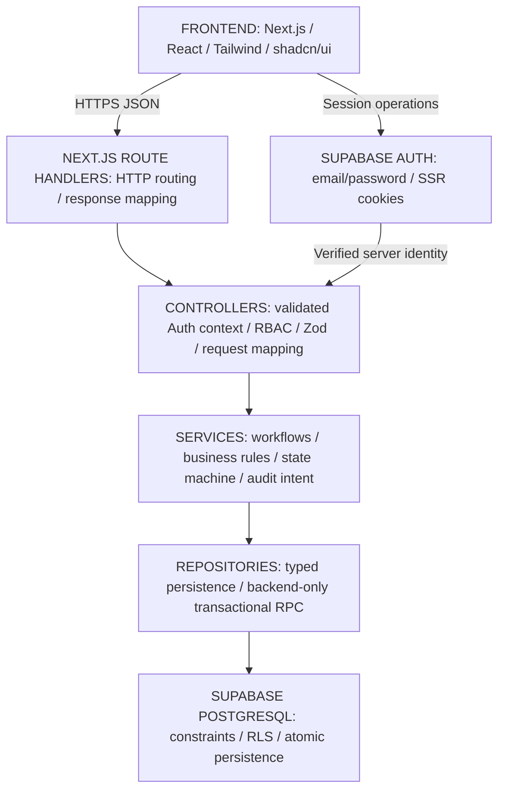

# 14 - Architecture decisions and approval register

Classification follows [00](00_PROJECT_CHARTER.md). Assessment source: the supplied six-page Webtezza challenge, sections 1-16. User sources: the original G00 request and the subsequent decision-approval table. External references validate feasibility, not add manufacturing requirements.

**Approval recorded:** 2026-10-06, Asia/Colombo, by the user in this conversation. The decision table approved 25 directions; the subsequent admin-creation clarification approves UD-022. All 26 decisions are now approved and removed from UNRESOLVED_DECISIONS. G00 documentation/Git work and G01 scaffolding are complete. The subsequent explicit G02 request authorizes merging G01 and Supabase infrastructure on a separate branch; it stops before G03.

## Captured architecture decisions

| ID | Classification/status | Decision and consequence |
|---|---|---|
| ADR-001 | DESIGN DECISION, approved by user | Next.js + TypeScript; one application for UI/HTTP API. Select/pin exact compatible package versions in G01; versions do not block architecture. |
| ADR-002 | DESIGN DECISION, approved by user | Modular monolith with Frontend -> Route Handler -> Controller -> Service -> Repository. No business logic/direct queries in routes. |
| ADR-003 | DESIGN DECISION, approved by user | Supabase PostgreSQL/Auth; no Prisma/Auth.js. auth.users is authentication authority; public.profiles owns application user/role data; no duplicate password hash. |
| ADR-004 | DESIGN DECISION, approved by user | Server RBAC plus Supabase RLS defense. One factory/no tenancy; role-permitted visibility, no creator-owned filtering. |
| ADR-005 | DESIGN DECISION, approved by user | Browser Supabase for Auth/session; privileged business operations through backend layers. Elevated secrets remain server-only with additional guards. |
| ADR-006 | DESIGN DECISION, approved by user | Zod input validation plus independent service rules. Positive integer target, nonnegative integer counts, positive fabric up to three decimal places. |
| ADR-007 | DESIGN DECISION, approved by user | Critical transitions use backend-only PostgreSQL transaction/RPC. Approval rereads authoritative DB counts and atomically commits immutable sign-off/VERIFIED. |
| ADR-008 | DESIGN DECISION, approved by user | Tailwind/shadcn/ui, Vitest/Playwright, Vercel. Light responsive desktop-first UI, text+color status, visible focus/errors; no dark mode required. |
| ADR-009 | APPROVED EXTENSION | SYSTEM_ADMIN manages production users/roles and administrative audit only; never production or impersonation. |
| ADR-010 | DESIGN DECISION, approved by user | One protected role/user; creator can never verify their own order after reassignment; admin cannot self-assign production. |
| ADR-011 | DESIGN DECISION, approved by user | Seeded read-only recipes, frozen BOM/expectations at first submission, same-order re-cut/new attempts, recipe/target frozen thereafter. Previous attempts and audit evidence immutable; no hard deletion. |
| ADR-012 | DESIGN DECISION, approved by user | Keep VERIFIED when sewing starts; set sewing_started_at/started_by on order. No additional initial production status. |
| ADR-013 | DESIGN DECISION, implementation detail | Common row-lock/revision protocol reinforces approved transaction/authoritative-reread decisions. This is engineering detail, not a reopened architecture blocker. |
| ADR-014 | DESIGN DECISION, approved by user | Stable REST-style /api routes and JSON; wrong role 403, hard stop/invalid reason 422, state conflict 409. |
| ADR-015 | DESIGN DECISION, approved by user | G00 stays documentation only, with first commit on a new branch merged locally into main. No source/packages/migrations/G01 in this task. |
| ADR-016 | DESIGN DECISION, approved by user | Synchronous admin creation with email/full name/production role/temporary password: backend Auth create, then profile persist. If profile fails, attempt cleanup of new Auth user and return error; no async provisioning system. |

## APPROVED_DECISIONS

Historical UD IDs are retained for traceability; they no longer indicate unresolved status. These statements record the user's approved directions, including the latest admin clarification. Detailed tables, routes, bounds, and lock mechanics are implementation details within those directions.

| ID | Approved decision |
|---|---|
| UD-001 | Component/target quantities are integers; actual component count may be 0. Actual fabric is positive with at most three decimal places. Target/fabric cannot be 0. |
| UD-002 | YELLOW can proceed. The quantity gate blocks RED, missing, or uncounted required components; excess is not a failure. |
| UD-003 | Wastage cap is a warning/analytics value, never an approval gate. |
| UD-004 | Preserve signed negative fabric variance; do not clamp it. |
| UD-005 | Order begins CUTTING_IN_PROGRESS; supervisor submits to PENDING_VERIFICATION. |
| UD-006 | Re-cut reuses the same order with a new verification attempt. Recipe/target freeze after first submission; previous attempts remain immutable. |
| UD-007 | Keep production status VERIFIED; Start Sewing records sewing_started_at, started_by, and related metadata without adding another production status initially. |
| UD-008 | Recipes are seeded/read-only for assessment scope. Snapshot required BOM/expected quantities on first submission. |
| UD-009 | Single factory/plant, no tenancy. Production record visibility follows role permissions, without creator-ownership restrictions. |
| UD-010 | One role/user. An order creator cannot later verify that order even after role change. Admin cannot self-assign production privileges. |
| UD-011 | First SYSTEM_ADMIN manually bootstrapped through Supabase. Admin cannot deactivate/demote itself or create/promote another SYSTEM_ADMIN through normal UI/API. |
| UD-012 | Critical transitions, including approval, use PostgreSQL transaction/RPC invoked only through backend service/repository layers. |
| UD-013 | UUID primary keys, server-generated human order numbers, UTC storage, reasonable bounded numeric columns. Concrete formats/ranges are engineering details. |
| UD-014 | No hard deletion; users are deactivated. Approved verification and audit records are immutable; historical attempts retained under UD-006. |
| UD-015 | Supabase email/password auth, distinct real demo accounts, cookie-based SSR session, public signup disabled. |
| UD-016 | Explicit Save Counts, no autosave. Approval rereads authoritative DB values before committing. |
| UD-017 | Verifier may reject physical defects even with GREEN counts; every rejection needs a reason. |
| UD-018 | Trim reason; require nonempty/max 1000 characters; invalid reason returns 422. |
| UD-019 | Stable REST-style /api routes and JSON; wrong role 403, business hard stop 422, state conflict 409. |
| UD-020 | Select/pin exact package versions in G01; version selection does not block architecture. |
| UD-021 | image_url nullable; component name suffices when no image exists. |
| UD-022 | Admin enters email/full name/production role/temporary password; POST /api/admin/users -> AdminUserController -> AdminUserService -> Supabase Admin API creates Auth user -> public.profiles row. If profile creation fails, attempt cleanup of the newly created Auth user and return error. Synchronous creation is sufficient; no invitation/async ledger required. |
| UD-023 | Same-origin cookie auth, server-side origin protection on mutations, no-store private app data. No elaborate MVP rate-limiting system. |
| UD-024 | Four days/28-32 hours remain assessment schedule; scheduling is not an architecture blocker. Admin work stays secondary to core assessment. |
| UD-025 | auth.users owns authentication; public.profiles owns application user/role data. No duplicate password hash. |
| UD-026 | Light, desktop-first responsive UI, text+color statuses, visible focus/errors. No dark-mode requirement. |

## Logical architecture

**DESIGN DECISION (approved by user):**

Cross-cutting: validated identity, current server RBAC, strict schemas, RLS, immutable audit, database constraints, predictable errors, automated tests, same-origin protection/private no-store data. Detailed module responsibilities are in [05](05_DOMAIN_MODEL.md), atomic persistence in [06](06_DATABASE_DESIGN.md), access contexts in [07](07_AUTH_SECURITY_RBAC_RLS.md).

Services own rules; repositories execute typed persistence. Database command revalidation on locked values reinforces rules against races. It is not an alternative to service authorization or a route-level business implementation.

## Assessment interpretations and extension compatibility

The original assessment wording remains recorded; the user's approved interpretations now resolve the project ambiguities.

| ID | Assessment wording/tension | Approved project interpretation |
|---|---|---|
| C-01 | Section 11 p.5 broadly bans decimals; recipe rates/fabric analytics use decimal measures (7.1/7.5 p.3). | UD-001: discrete quantities integer; positive actual yards allowed to three decimal places. Explicit user-approved interpretation, not a silent exception. |
| C-02 | Section 3 p.1 says no mismatched batches; 7.3 p.3 explicitly permits YELLOW. | UD-002: preserve specific YELLOW allowance; quantity hard stop is RED/missing/uncounted. |
| C-03 | Seed recipes supply caps but no cap-based gate. | UD-003/UD-004: warning/analytics only; signed fabric variance retained. |
| C-04 | Sample users includes password_hash; approved Auth manages credentials and schema refinements are allowed (8 p.4). | UD-025: auth.users + public.profiles, no duplicate hash. |
| C-05 | Start Sewing required, database Sewing Queue must filter VERIFIED (7.5/9 pp.3-4). | UD-007: VERIFIED stays; server start metadata on existing order. |
| C-06 | Rejection returns for re-cut; persistence/reset mechanics not supplied (6/7.4 pp.2-3). | UD-005/UD-006/UD-008/UD-016: same order/new immutable attempts; frozen recipe/target/BOM; explicit saves and authoritative reread. |
| C-07 | Admin outside three assessment production roles can undermine separation if a superuser. | UD-010/UD-011: no production authority/self-assignment/self-deactivation/self-demotion; manual first-admin bootstrap; creator never verifies same order. |
| C-08 | Assessment calls for implementation/cloud/tests in four days; current task is documentation/version control. | G00 remains docs only; UD-020 selects versions at G01, UD-024 keeps admin secondary and removes schedule as architecture blocker. |
| C-09 | Established records are not hard-deleted (UD-014); latest UD-022 requires cleanup after failed profile creation. | Cleanup may remove only the newly created incomplete Auth identity as rollback. Existing users/profiles/production/audit remain protected; failed cleanup still returns error and missing-profile access stays denied. |

Approved Next.js/TypeScript/Supabase/Vercel fits the permitted assessment stack. Technical schema refinements preserve required relational entities. The latest admin decision replaces the earlier durable invitation proposal; neither documentation approval nor Git work claims runtime readiness.

## UNRESOLVED_DECISIONS

None. All 26 historical decisions have approved directions recorded above. G01/G02 package versions are selected/pinned below, and the assessment schedule is not an architecture blocker. G02 infrastructure is currently authorized; G03 and later implementation still require their separately requested milestones.

## G00 completion record

All fifteen documents reflect the approved decisions. Requirements, approved interpretations, implementation details, and the approved synchronous admin provisioning direction are distinguished. Documentation validation covers structure, links, example payloads, decision/test references, and cross-document consistency.

The initial documentation commit `9b9a7a3` was created on a new branch and merged locally into main as authorized. No application code, packages, migrations, database changes, cloud provisioning, deployment, root submission artifacts, or G01 work belonged to G00.

## G01 scaffold decisions

**DESIGN DECISION (implementation detail under approved UD-020):** The explicit G01 request authorizes a scaffold on `chore/g01-nextjs-scaffold`, based on G00 commit `9b9a7a3`. Existing business decisions are preserved. G01 does not authorize a Supabase connection, migrations, authentication, production APIs/features, deployment, or G02.

| ID | Concrete scaffold choice and rationale |
|---|---|
| ADR-017 | Next.js 16.3.8 stable, React/React DOM 19.3.0, App Router under src/app, default Turbopack. No Pages Router, React Compiler customization, Prisma, or Auth.js. System fonts avoid a build-time font download. |
| ADR-018 | Node 22.23.2 pinned in .nvmrc; supported project engine >=22.12.0 <23. npm 10.9.8 recorded in packageManager; engine >=10.9.0 <11. The Node floor satisfies Vitest 5 as well as Next.js. Exact direct dependency versions plus package-lock.json, save-exact, and npm ci provide reproducible installation. |
| ADR-019 | TypeScript 5.9.3 with strict, noUncheckedIndexedAccess, exactOptionalPropertyTypes, bundler resolution, and @/* -> src/*. Package type is module, including the Vitest configuration. Choose TypeScript 5 / ESLint 9 for compatibility: current Next.js React/import/accessibility plugins declare ESLint 9 support, not ESLint 10. ESLint 9.39.5 is upstream EOL; this tooling limitation is explicitly recorded rather than forcing unsupported peer versions. Next route types are generated before tsc. Lint uses Core Web Vitals/TypeScript, explicit-any rejection, and zero warnings; Prettier 3.9.9/EditorConfig define formatting while retaining approved G00 document formatting. |
| ADR-020 | Tailwind 4.3.3 with matching PostCSS plugin; shadcn 4.21.3 manually initialized using base-nova, RSC/TSX, neutral light CSS-variable theme, components.json, CSS imports, and cn 0.4.0 re-exported from src/lib/utils/index.ts. No UI components or dark-mode implementation. Zod 4.6.5 installed without speculative schemas. |
| ADR-021 | Vitest 5.0.3 runs tests/unit and tests/integration in Node, with the same @ alias and explicit test imports. Only the class utility has unit smoke coverage. Playwright 1.63.0 runs a home-page smoke test in desktop/mobile Chromium against an isolated production server; test:e2e builds first and remains separate from npm test. No business/integration tests are claimed. |
| ADR-022 | Future route groups, components, domain modules, server layers, Supabase adapters, types, and integration tests are documented in README; create each directory only when real implementation exists. Current source is root layout/page/styles and the shadcn utility. Future error concepts retain the status mapping in 08; no placeholder error framework, controllers, services, repositories, or APIs. |

The complete dependency/version inventory is authoritative in [package.json](../package.json) and its lockfile. The source tree, scripts, local setup, and future directory layout are documented in [README](../README.md).

Setup follows the official [Next.js App Router installation](https://nextjs.org/docs/app/getting-started/installation), [Tailwind Next.js setup](https://tailwindcss.com/docs/installation/framework-guides/nextjs), and [shadcn manual installation](https://ui.shadcn.com/docs/installation/manual). Public placeholder naming follows [Supabase SSR client guidance](https://supabase.com/docs/guides/auth/server-side/creating-a-client); no client is created in G01. SUPABASE_SERVICE_ROLE_KEY is documented only as server-only, never public or browser-exposed.

Security boundaries remain those in 07/12: UI is not authority; privileged APIs authenticate/authorize on the server; RLS reinforces access; repositories/Auth adapters isolate privileged clients; same-origin mutations and private no-store data apply when those routes exist; no generic production-status mutation.

### Dependency limitations

`npm audit --omit=dev` reports zero vulnerabilities. Full `npm audit` reports nine high-severity findings propagated through development-only Next.js lint and shadcn CLI dependencies from braces 3.0.3. The [upstream advisory](https://github.com/advisories/GHSA-vfj7-8cjw-p6xm) lists no patched version. Do not use audit's suggested major downgrades to obsolete Next.js/shadcn tooling, suppress the finding, or claim a clean full audit. Recheck when an upstream fix is available.

[ESLint's support policy](https://eslint.org/version-support/) marks version 9 EOL. Current eslint-plugin-react/import/jsx-a11y peer declarations do not include version 10; retain compatible tooling rather than forcing unsupported peers. Revisit when the Next.js plugin stack supports ESLint 10. Neither limitation changes a business rule or prevents the scaffold checks from running.

### G01 completion evidence

Verified locally on 2026-10-06 using Node 22.23.2/npm 10.9.8. These checks cover only the scaffold, not the future production acceptance cases:

| Check | Actual result |
|---|---|
| npm install; fresh npm ci | Both succeeded; lockfile matches all 21 exact direct dependency pins. Recorded audit/EOL limitations above remain. |
| npm run typecheck | Passed Next.js type generation and strict tsc with no errors. |
| npm run lint | Passed with zero errors/warnings. |
| npm test | One Vitest file, two class-utility tests passed; no browser launch. |
| npm run format:check | Passed for all scaffold files; existing numbered-document formatting preserved. |
| npx shadcn info | Recognized Next.js/src/RSC/TypeScript/Tailwind 4/base-nova and all aliases; no UI components installed. |
| npm run test:e2e | Production build passed; desktop/mobile Chromium smoke tests both passed. Initial run preceded completion of browser download and failed launch; after installation, direct Playwright rerun and full test:e2e rerun passed. |
| Production boot | Playwright-owned next start server returned HTTP 200; home content/title visible, no horizontal overflow or browser page errors on both viewport sizes. Server stopped after tests. |
| npm audit --omit=dev | Zero production vulnerabilities. Full audit has nine development-only high findings; not represented as a clean audit. |
| Scope/link/Git review | All fifteen docs retained, twelve unchanged; local Markdown links valid; no business APIs, Supabase wiring, secrets, migrations, fake auth, or placeholder files. git diff --check passed. |

At the end of the original G01 turn, the branch contained 23 new scaffold/configuration/test files and modifications only to documents 00, 13, and 14; no commit, merge, push, deployment, or G02 had been performed then. No blocking scaffolding decisions or failed required checks remained.

### Subsequent G01 merge

The user committed G01 as 8bc0103a6b7fd325601918af131b700d5e8904b5. Their subsequent G02 request explicitly authorized creating and merging the previous PR first. [PR #1](https://github.com/SMS123456789/apparel-flow/pull/1) was created and merged on 2026-10-06, producing main merge c8ec89bc958bb2ec1d45d227e49148ad6d798c7f. Local main and chore/g02-supabase-foundation were fast-forwarded to that merge; G01 history was preserved.

## G02 Supabase foundation decisions

**DESIGN DECISION (implementation detail under the explicit G02 request):** Infrastructure is implemented on chore/g02-supabase-foundation, based on the G01 merge. Approved manufacturing/admin decisions are unchanged. No G03 schema, auth feature, RBAC/RLS policy, business API, seed, user creation, deployment, or cloud mutation belongs to G02.

| ID | Concrete infrastructure choice and rationale |
|---|---|
| ADR-023 | Exact application pins: @supabase/supabase-js 2.117.2, @supabase/ssr 0.12.7, server-only 0.0.1. Development pins: supabase CLI 2.119.0, @next/env 16.3.8 matching Next, and tsx 4.23.15 for the TypeScript diagnostic script. npm ci and the existing Node/npm conventions remain authoritative. |
| ADR-024 | Split Zod environment validation: public URL/publishable key only, separate server-only SUPABASE_SECRET_KEY. Reject privileged keys in the public field; strip unrelated fields; report invalid/missing variable names without values. Validate lazily so home/offline checks need no live credentials. Legacy anon/service_role values map to the current public/secret variables without becoming user-identity authority. The configured ignored .env legacy variable was renamed locally, preserving its value. |
| ADR-025 | Browser factory uses SSR createBrowserClient and only public configuration. Async server factory awaits cookies(), creates one user-context client per request, writes cookies, and forwards SSR cache headers to the caller's Headers. The caller must include those headers in its response. Cookie-write errors propagate; writable Route Handler/Server Action use is supported. Read-only rendering and refresh proxy integration wait for G05 because no authenticated pages/session workflow exists yet. |
| ADR-026 | Privileged factory and server env import server-only. Privileged auth persistence, refresh, and URL-session detection are disabled. Both server factories fetch with no-store. Elevated access is reserved for future authorized backend adapters/repositories; it does not grant application roles or replace service authorization/RLS-scoped reads. No factory is invoked by the current home page. |
| ADR-027 | CLI-generated supabase/config.toml establishes a cloud-first migration workflow. Every application schema change must have version-controlled SQL; review migration state and dry-run before a separately authorized push. No fake migration/directory, SQL, seed, or Database type is created. Optional local Docker stack is not adopted in G02. Local config disables signup, seeds, and implicit table exposure; PostgreSQL 17 is the generated default and must match cloud before local migration tests. Local config does not change cloud Auth settings. |
| ADR-028 | npm run supabase:check uses Next env loading, public-key GET Auth health, privileged-key GET Data API OpenAPI metadata, and one read-only SDK Auth user-list call. It prints only controlled status/variable-name errors, never bodies/users/credentials. No public health route, tables, records, users, schema mutations, or RLS weakening. CLI login/linking and generated types remain future operator/G03 work. |

Implementation follows current primary guidance: [SSR factories/cookies](https://supabase.com/docs/guides/auth/server-side/creating-a-client), [API-key terminology and legacy mapping](https://supabase.com/docs/guides/getting-started/api-keys), [SDK client initialization](https://supabase.com/docs/reference/javascript/initializing), [CLI setup](https://supabase.com/docs/guides/local-development/cli/getting-started), and [migration workflow](https://supabase.com/docs/guides/deployment/database-migrations).

The initial public-key OpenAPI probe received HTTP 401. Supabase's [current OpenAPI access change](https://supabase.com/changelog/42949-breaking-change-removing-access-to-openapi-spec-via-the-anon-key) requires a secret/service credential for that metadata endpoint. The trusted diagnostic now uses that supported credential, while Auth health retains the public key. This is an infrastructure read, not a production data/RLS bypass or an architecture change. All three real checks then passed without displaying returned data.

No business-rule or architecture deviations were introduced. CLI operator login/linking is not configured, and no local Docker stack is available; these optional workflows do not block the verified cloud API foundation. G03 remains separately authorized work.

### G02 completion evidence

Verified locally on 2026-10-06 using Node 22.23.2/npm 10.9.8. Infrastructure unit tests use mocks/synthetic configuration and do not call the live project. The separate diagnostic uses the configured ignored environment.

| Check | Actual result |
|---|---|
| npm ci | Passed fresh installation; all 27 exact direct pins match lockfile. Existing development-only audit/EOL limitations remain. |
| npm run typecheck | Passed Next.js route generation and strict TypeScript without errors. |
| npm run lint | Passed with zero errors/warnings. |
| npm run format:check | Passed all matched files; numbered-doc formatting preserved. |
| npm test | Three files, 24 tests passed: two existing class-utility tests and 22 environment/factory cases. Initial malformed URL test exposed a raw URL-parser error; validation was fixed and the complete suite rerun successfully. |
| npm run test:e2e | Production build and both desktop/mobile Chromium home tests passed. Production server returned HTTP 200 with no page errors/overflow and stopped after tests. |
| npm run build | Separate final production build passed; only home and not-found routes exist. |
| npm run supabase:check | Auth health HTTP 200; privileged Data API OpenAPI metadata HTTP 200; privileged SDK Auth read succeeded. No response bodies/users displayed and no mutations performed. |
| Supabase CLI/config | Version 2.119.0 and actual command help verified; config parses, migration support enabled, signup/seeds/implicit table exposure disabled. No SQL files. Local status returned exit 1 because Docker is unavailable; whoami returned exit 1 because operator login is not configured. No start/link/push/reset executed. |
| Browser/server guard | Temporary Client Component importing the privileged factory made Next.js reject server-only imports as expected; probe removed before final build/tests. Unit mocks do not weaken the actual build safeguard. |
| Credential audit | .env/.env.local ignored and untracked; .env.example placeholders only. Configured server key/database password absent from all trackable files, Git diff, and 45 generated JavaScript files; nine browser JavaScript files contain no secret-variable references. No elevated secrets logged. |
| npm audit --omit=dev; full audit | Production audit passed with zero vulnerabilities. Full audit still reports nine high development-tooling findings inherited from G01; not claimed clean. |
| Scope/docs/Git | README and all fifteen numbered documents have valid local links/anchors. No business calls/APIs/tables, auth feature/proxy, fake sessions/roles, generated Database type, or placeholder migrations. git diff --check passed. |

G02 changes comprise eleven new infrastructure/config/test files and ten modified template/package/test/documentation files, suitable for one focused commit. The ignored local .env update is excluded from Git. G02 remains uncommitted on chore/g02-supabase-foundation; the request to create/merge the previous G01 PR has been completed separately. No required checks remain failed and no G02 blockers remain. **G02 COMPLETE — READY FOR G03**, stopping before schema/auth/business implementation.
