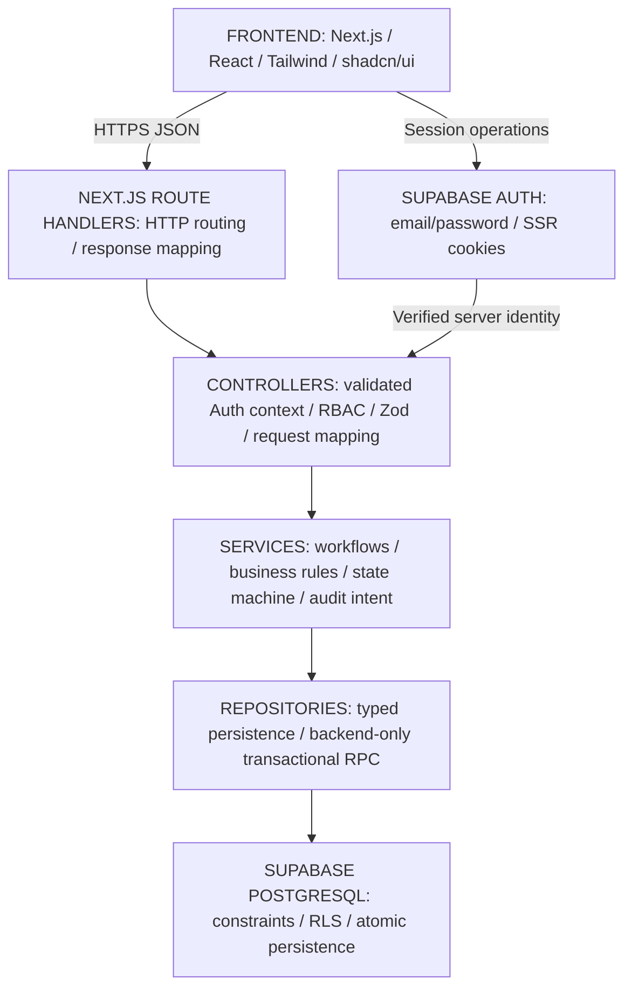

# 14 - Architecture decisions and approval register

Classification follows [00](00_PROJECT_CHARTER.md). Assessment source: the supplied six-page Webtezza challenge, sections 1-16. User sources: the original G00 request and the subsequent decision-approval table. External references validate feasibility, not add manufacturing requirements.

**Approval recorded:** 2026-10-06, Asia/Colombo, by the user in this conversation. The decision table approved 25 directions; the subsequent admin-creation clarification approves UD-022. All 26 decisions are now approved and removed from UNRESOLVED_DECISIONS. Approved scope is documentation and local branch/commit/merge work; G01 has not been requested.

## Captured architecture decisions

| ID | Classification/status | Decision and consequence |
|---|---|---|
| ADR-001 | DESIGN DECISION, approved by user | Next.js + TypeScript; one application for UI/HTTP API. Select/pin exact compatible package versions in G01; versions do not block architecture. |
| ADR-002 | DESIGN DECISION, approved by user | Modular monolith with Frontend -> Route Handler -> Controller -> Service -> Repository. No business logic/direct queries in routes. |
| ADR-003 | DESIGN DECISION, approved by user | Supabase PostgreSQL/Auth; no Prisma/Auth.js. auth.users is authentication authority; public.profiles owns application user/role data; no duplicate password hash. |
| ADR-004 | DESIGN DECISION, approved by user | Server RBAC plus Supabase RLS defense. One factory/no tenancy; role-permitted visibility, no creator-owned filtering. |
| ADR-005 | DESIGN DECISION, approved by user | Browser Supabase for Auth/session; privileged business operations through backend layers. Elevated secrets remain server-only with additional guards. |
| ADR-006 | DESIGN DECISION, approved by user | Zod input validation plus independent service rules. Positive integer target, nonnegative integer counts, positive fabric up to three decimal places. |
| ADR-007 | DESIGN DECISION, approved by user | Critical transitions use backend-only PostgreSQL transaction/RPC. Approval rereads authoritative DB counts and atomically commits immutable sign-off/VERIFIED. |
| ADR-008 | DESIGN DECISION, approved by user | Tailwind/shadcn/ui, Vitest/Playwright, Vercel. Light responsive desktop-first UI, text+color status, visible focus/errors; no dark mode required. |
| ADR-009 | APPROVED EXTENSION | SYSTEM_ADMIN manages production users/roles and administrative audit only; never production or impersonation. |
| ADR-010 | DESIGN DECISION, approved by user | One protected role/user; creator can never verify their own order after reassignment; admin cannot self-assign production. |
| ADR-011 | DESIGN DECISION, approved by user | Seeded read-only recipes, frozen BOM/expectations at first submission, same-order re-cut/new attempts, recipe/target frozen thereafter. Previous attempts and audit evidence immutable; no hard deletion. |
| ADR-012 | DESIGN DECISION, approved by user | Keep VERIFIED when sewing starts; set sewing_started_at/started_by on order. No additional initial production status. |
| ADR-013 | DESIGN DECISION, implementation detail | Common row-lock/revision protocol reinforces approved transaction/authoritative-reread decisions. This is engineering detail, not a reopened architecture blocker. |
| ADR-014 | DESIGN DECISION, approved by user | Stable REST-style /api routes and JSON; wrong role 403, hard stop/invalid reason 422, state conflict 409. |
| ADR-015 | DESIGN DECISION, approved by user | G00 stays documentation only, with first commit on a new branch merged locally into main. No source/packages/migrations/G01 in this task. |
| ADR-016 | DESIGN DECISION, approved by user | Synchronous admin creation with email/full name/production role/temporary password: backend Auth create, then profile persist. If profile fails, attempt cleanup of new Auth user and return error; no async provisioning system. |

## APPROVED_DECISIONS

Historical UD IDs are retained for traceability; they no longer indicate unresolved status. These statements record the user's approved directions, including the latest admin clarification. Detailed tables, routes, bounds, and lock mechanics are implementation details within those directions.

| ID | Approved decision |
|---|---|
| UD-001 | Component/target quantities are integers; actual component count may be 0. Actual fabric is positive with at most three decimal places. Target/fabric cannot be 0. |
| UD-002 | YELLOW can proceed. The quantity gate blocks RED, missing, or uncounted required components; excess is not a failure. |
| UD-003 | Wastage cap is a warning/analytics value, never an approval gate. |
| UD-004 | Preserve signed negative fabric variance; do not clamp it. |
| UD-005 | Order begins CUTTING_IN_PROGRESS; supervisor submits to PENDING_VERIFICATION. |
| UD-006 | Re-cut reuses the same order with a new verification attempt. Recipe/target freeze after first submission; previous attempts remain immutable. |
| UD-007 | Keep production status VERIFIED; Start Sewing records sewing_started_at, started_by, and related metadata without adding another production status initially. |
| UD-008 | Recipes are seeded/read-only for assessment scope. Snapshot required BOM/expected quantities on first submission. |
| UD-009 | Single factory/plant, no tenancy. Production record visibility follows role permissions, without creator-ownership restrictions. |
| UD-010 | One role/user. An order creator cannot later verify that order even after role change. Admin cannot self-assign production privileges. |
| UD-011 | First SYSTEM_ADMIN manually bootstrapped through Supabase. Admin cannot deactivate/demote itself or create/promote another SYSTEM_ADMIN through normal UI/API. |
| UD-012 | Critical transitions, including approval, use PostgreSQL transaction/RPC invoked only through backend service/repository layers. |
| UD-013 | UUID primary keys, server-generated human order numbers, UTC storage, reasonable bounded numeric columns. Concrete formats/ranges are engineering details. |
| UD-014 | No hard deletion; users are deactivated. Approved verification and audit records are immutable; historical attempts retained under UD-006. |
| UD-015 | Supabase email/password auth, distinct real demo accounts, cookie-based SSR session, public signup disabled. |
| UD-016 | Explicit Save Counts, no autosave. Approval rereads authoritative DB values before committing. |
| UD-017 | Verifier may reject physical defects even with GREEN counts; every rejection needs a reason. |
| UD-018 | Trim reason; require nonempty/max 1000 characters; invalid reason returns 422. |
| UD-019 | Stable REST-style /api routes and JSON; wrong role 403, business hard stop 422, state conflict 409. |
| UD-020 | Select/pin exact package versions in G01; version selection does not block architecture. |
| UD-021 | image_url nullable; component name suffices when no image exists. |
| UD-022 | Admin enters email/full name/production role/temporary password; POST /api/admin/users -> AdminUserController -> AdminUserService -> Supabase Admin API creates Auth user -> public.profiles row. If profile creation fails, attempt cleanup of the newly created Auth user and return error. Synchronous creation is sufficient; no invitation/async ledger required. |
| UD-023 | Same-origin cookie auth, server-side origin protection on mutations, no-store private app data. No elaborate MVP rate-limiting system. |
| UD-024 | Four days/28-32 hours remain assessment schedule; scheduling is not an architecture blocker. Admin work stays secondary to core assessment. |
| UD-025 | auth.users owns authentication; public.profiles owns application user/role data. No duplicate password hash. |
| UD-026 | Light, desktop-first responsive UI, text+color statuses, visible focus/errors. No dark-mode requirement. |

## Logical architecture

**DESIGN DECISION (approved by user):**

Cross-cutting: validated identity, current server RBAC, strict schemas, RLS, immutable audit, database constraints, predictable errors, automated tests, same-origin protection/private no-store data. Detailed module responsibilities are in [05](05_DOMAIN_MODEL.md), atomic persistence in [06](06_DATABASE_DESIGN.md), access contexts in [07](07_AUTH_SECURITY_RBAC_RLS.md).

Services own rules; repositories execute typed persistence. Database command revalidation on locked values reinforces rules against races. It is not an alternative to service authorization or a route-level business implementation.

## Assessment interpretations and extension compatibility

The original assessment wording remains recorded; the user's approved interpretations now resolve the project ambiguities.

| ID | Assessment wording/tension | Approved project interpretation |
|---|---|---|
| C-01 | Section 11 p.5 broadly bans decimals; recipe rates/fabric analytics use decimal measures (7.1/7.5 p.3). | UD-001: discrete quantities integer; positive actual yards allowed to three decimal places. Explicit user-approved interpretation, not a silent exception. |
| C-02 | Section 3 p.1 says no mismatched batches; 7.3 p.3 explicitly permits YELLOW. | UD-002: preserve specific YELLOW allowance; quantity hard stop is RED/missing/uncounted. |
| C-03 | Seed recipes supply caps but no cap-based gate. | UD-003/UD-004: warning/analytics only; signed fabric variance retained. |
| C-04 | Sample users includes password_hash; approved Auth manages credentials and schema refinements are allowed (8 p.4). | UD-025: auth.users + public.profiles, no duplicate hash. |
| C-05 | Start Sewing required, database Sewing Queue must filter VERIFIED (7.5/9 pp.3-4). | UD-007: VERIFIED stays; server start metadata on existing order. |
| C-06 | Rejection returns for re-cut; persistence/reset mechanics not supplied (6/7.4 pp.2-3). | UD-005/UD-006/UD-008/UD-016: same order/new immutable attempts; frozen recipe/target/BOM; explicit saves and authoritative reread. |
| C-07 | Admin outside three assessment production roles can undermine separation if a superuser. | UD-010/UD-011: no production authority/self-assignment/self-deactivation/self-demotion; manual first-admin bootstrap; creator never verifies same order. |
| C-08 | Assessment calls for implementation/cloud/tests in four days; current task is documentation/version control. | G00 remains docs only; UD-020 selects versions at G01, UD-024 keeps admin secondary and removes schedule as architecture blocker. |
| C-09 | Established records are not hard-deleted (UD-014); latest UD-022 requires cleanup after failed profile creation. | Cleanup may remove only the newly created incomplete Auth identity as rollback. Existing users/profiles/production/audit remain protected; failed cleanup still returns error and missing-profile access stays denied. |

Approved Next.js/TypeScript/Supabase/Vercel fits the permitted assessment stack. Technical schema refinements preserve required relational entities. The latest admin decision replaces the earlier durable invitation proposal; neither documentation approval nor Git work claims runtime readiness.

## UNRESOLVED_DECISIONS

None. All 26 historical decisions have approved directions recorded above. Exact package versions are selected/pinned during G01 and the assessment schedule is not an architecture blocker. Implementation still needs its separately requested milestone; the current task is documentation plus authorized local Git work.

## G00 completion record

All fifteen documents reflect the approved decisions. Requirements, approved interpretations, implementation details, and the single unapproved admin provisioning proposal are distinguished. Documentation validation covers structure, links, example payloads, decision/test references, and cross-document consistency.

The user has authorized the initial documentation commit on a new branch and local merge into main. This is version-control work only. No application code, packages, migrations, database changes, cloud provisioning, deployment, root submission artifacts, or G01 work belong to this task.
